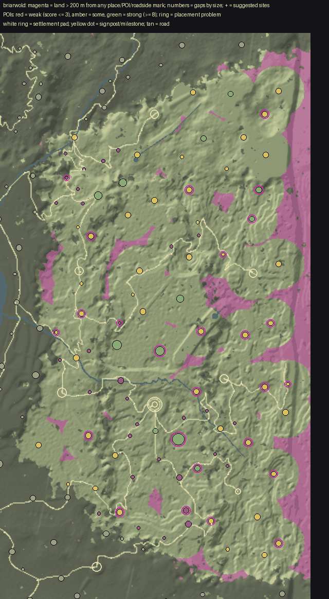

# World life audit: Briarwold

Made by `python3 tools/world/region_audit.py briarwold` from the installed world (2026-09-30T09:38:35Z) and the content pack; the POI measurements are `docs/review/world_life/probe_briarwold.json` (tools_gd/poi_probe.gd, headless). docs/WORLD_LIFE.md says how to read and use it.

## Summary

| | |
|---|---|
| land a body walks (dry, no steeper than 32 deg, 250 m in from the map's edge) | 6.1 km2 |
| points of interest | 89 (14.6 per km2; 3 not yet in the built world) |
| land more than 200 m from any place, POI or roadside mark | 0.25 km2 (4%); more than 400 m: 0% |
| share of land further than 100 / 150 / 200 / 300 / 400 m from anything | 47% / 20% / 4% / 0% / 0% |
| largest empty stretch | 0.00 km2 |
| weak POIs (score <= 3) | 3, and 28 wayside finds (small by design) |
| strong POIs (score >= 8) | 12 |
| placement problems | 38, at 26 POIs |

## (a) Empty land, largest first

A stretch is land of the region more than 200 m from the edge of every place's, POI's and roadside mark's pad. `furthest` is how far its middle is from anything. Sites are gentle ground (<= 14 deg) in it, as far from everything as it allows, nearer a road where one is near.

| # | middle (x, z) | km2 | extent m | furthest m | slope mean/p75 | height | province (biome) | road | sites (x, z, slope, road m) |
|---|---|---|---|---|---|---|---|---|---|

## (b) Points of interest, weakest first

Impact score, points for each: **size** footprint reach (m from the middle to its furthest piece): <8 = 0, <14 = 1, <22 = 2, <32 = 3, else 4; **things** interactables in the dressing (Hearthstone, touch, container, readable ...): 1 each, up to 3; **foes** an encounter that stands foes up: 1, and 1 more for 4 or more; **loot** something to take (an encounter's `lies`, a quest's item, a find): 1; **people** an NPC who lives or stands there: 1, 2 for two or more; **quest** a quest sends you there: 2; **interior** a door into an interior: 2; **landmark** a landmark model (a `scene` in pois.json): 2; **hearth** a Hearthstone: 1. **Weak** is 3 or under; **small** is a reach under 10 m. `reach` is metres from the middle to the furthest piece; `things` are interactables in the dressing (hearthstones, touches, containers); foes are the encounter's standing count; loot counts an encounter's `lies`, a find and a container.

| score | POI | kind | reach / pad m | pieces | draws | tris k | things | foes | loot | NPCs | quest | enc | interior | hearth | landmark | flags |
|---|---|---|---|---|---|---|---|---|---|---|---|---|---|---|---|---|
| 1 | The Fourth Brother `fourth_brother` | waystone | 2 / 14 | 7 | 7 | 1 | 0 | 0 | 2 | 0 |  | yes |  |  |  | WEAK small wayside |
| 1 | The Flood Stone `flood_stone` | waystone | 2 / 14 | 7 | 7 | 1 | 0 | 0 | 2 | 0 |  | yes |  |  |  | WEAK small wayside |
| 1 | The Leave Stone `leave_stone` | waystone | 2 / 14 | 7 | 7 | 1 | 0 | 0 | 2 | 0 |  | yes |  |  |  | WEAK small wayside |
| 1 | The Hart Count `hart_count` | waystone | 2 / 14 | 7 | 7 | 1 | 0 | 0 | 2 | 0 |  | yes |  |  |  | WEAK small wayside |
| 1 | The Hazelwick Rumour Stone `hazelwick_rumour_stone` | waystone | 2 / 14 | 10 | 10 | 2 | 0 | 0 | 2 | 0 |  | yes |  |  |  | WEAK small wayside |
| 1 | The Verderer's Moss Grave `verderers_moss_grave` | grave | 3 / 14 | 8 | 8 | 7 | 0 | 0 | 2 | 0 |  | yes |  |  |  | WEAK small wayside |
| 1 | The Road Knot `road_knot` | shrine | 3 / 14 | 24 | 24 | 17 | 0 | 0 | 2 | 0 |  | yes |  |  |  | WEAK small wayside |
| 1 | The Oil-Carriers' Stone `oil_carriers_stone` | shrine | 3 / 14 | 37 | 37 | 30 | 0 | 0 | 2 | 0 |  | yes |  |  |  | WEAK small wayside |
| 1 | The Bread Stone `bread_stone` | shrine | 3 / 14 | 24 | 24 | 17 | 0 | 0 | 2 | 0 |  | yes |  |  |  | WEAK small wayside |
| 1 | The Elderhold Charcoal Hut `elderhold_charcoal_hut` | hut | 6 / 14 | 5 | 5 | 3 | 0 | 0 | 2 | 0 |  | yes |  |  |  | WEAK small wayside |
| 1 | The Uncarried `uncarried_stones` | standing_stones | 7 / 14 | 12 | 12 | 54 | 0 | 0 | 2 | 0 |  | yes |  |  |  | WEAK small wayside |
| 1 | The Drunk Stones `drunk_stones` | standing_stones | 8 / 14 | 12 | 12 | 54 | 0 | 0 | 2 | 0 |  | yes |  |  |  | WEAK small wayside |
| 2 | Foxfire Falls `foxfire_falls` | waterfall | 0 / 25 | 13 | 13 | 217 | 0 | 2 | 4 | 0 |  | yes |  |  |  | WEAK small |
| 2 | The Torch Stone `torch_stone` | shrine | 3 / 14 | 24 | 24 | 17 | 0 | 1 | 2 | 0 |  | yes |  |  |  | WEAK small wayside |
| 2 | The Moss Bed `moss_bed` | shrine | 3 / 14 | 24 | 24 | 17 | 0 | 1 | 2 | 0 |  | yes |  |  |  | WEAK small wayside |
| 2 | The Silence Stones `silence_stones` | standing_stones | 7 / 14 | 12 | 12 | 56 | 0 | 2 | 2 | 0 |  | yes |  |  |  | WEAK small wayside |
| 2 | The Knight's Challenge `knights_challenge` | standing_stones | 8 / 14 | 12 | 12 | 54 | 0 | 1 | 2 | 0 |  | yes |  |  |  | WEAK small wayside |
| 2 | The Antler-Smith's House `antler_smiths_house` | ruins | 10 / 14 | 32 | 32 | 174 | 0 | 0 | 2 | 0 |  | yes |  |  |  | WEAK small wayside |
| 3 | The Sentinels `the_sentinels` | standing_stones | 8 / 25 | 12 | 12 | 53 | 0 | 2 | 2 | 0 |  | yes |  |  |  | WEAK small |
| 3 | Wenna's House `wennas_house` | ruins | 10 / 14 | 15 | 15 | 129 | 0 | 1 | 2 | 0 |  | yes |  |  |  | WEAK wayside |
| 3 | The Antler Chapel `antler_chapel` | ruins | 10 / 25 | 24 | 24 | 400 | 0 | 1 | 2 | 0 |  | yes |  |  |  | WEAK |
| 3 | The Burnt Lodge `burnt_lodge` | ruins | 10 / 14 | 23 | 23 | 144 | 0 | 1 | 2 | 0 |  | yes |  |  |  | WEAK wayside |
| 3 | The Two Countries Bench `two_countries_bench` | vista | 10 / 14 | 10 | 10 | 93 | 0 | 1 | 2 | 0 |  | yes |  |  |  | WEAK wayside |
| 3 | The Webbed Lodge `webbed_lodge` | ruins | 11 / 14 | 23 | 23 | 152 | 0 | 2 | 2 | 0 |  | yes |  |  |  | WEAK wayside |
| 3 | The Sawyers' Bench `sawyers_bench` | vista | 11 / 14 | 10 | 10 | 84 | 0 | 2 | 2 | 0 |  | yes |  |  |  | WEAK wayside |
| 3 | The Masons' Lodge `masons_lodge` | ruins | 12 / 14 | 27 | 27 | 140 | 0 | 1 | 2 | 0 |  | yes |  |  |  | WEAK wayside |
| 3 | The Laid Fire `laid_fire` | camp | 14 / 14 | 62 | 62 | 57 | 0 | 0 | 2 | 0 |  | yes |  |  |  | WEAK wayside |
| 3 | The Silk-Gatherers' Camp `silk_gatherers_camp` | camp | 14 / 14 | 59 | 59 | 59 | 0 | 0 | 2 | 0 |  | yes |  |  |  | WEAK wayside |
| 3 | The Foxfire-Pickers' Camp `foxfire_pickers_camp` | camp | 15 / 14 | 59 | 59 | 56 | 0 | 0 | 2 | 0 |  | yes |  |  |  | WEAK wayside |
| 3 | The Coppice Round `coppice_round` | camp | 15 / 14 | 71 | 71 | 67 | 0 | 0 | 2 | 0 |  | yes |  |  |  | WEAK wayside |
| 3 | The Ringing Oak `ringing_oak` | strange_tree | 20 / 24 | 51 | 75 | 85 | 0 | 0 | 2 | 0 |  | yes |  |  |  | WEAK wayside |
| 4 | The Hartswell `hartswell` | well | 2 / 16 | 8 | 8 | 1 | 0 | 2 | 2 | 0 | yes | yes |  |  |  | small |
| 4 | The Northwold Beacon `wold_beacon` | beacon | 3 / 16 | 11 | 11 | 6 | 0 | 2 | 2 | 0 | yes | yes |  |  |  | small |
| 4 | The Oiled Stone `oiled_stone_shrine` | shrine | 3 / 25 | 44 | 44 | 30 | 1 | 0 | 0 | 0 | yes |  |  | yes |  | small |
| 4 | The Northgate Stone `northgate_stone` | shrine | 3 / 25 | 31 | 31 | 18 | 1 | 0 | 0 | 0 | yes |  |  | yes |  | small |
| 4 | The Old Gate Stone `old_gate_stone` | shrine | 3 / 25 | 31 | 31 | 18 | 1 | 0 | 0 | 0 | yes |  |  | yes |  | small |
| 4 | The Tally Hearth `tally_hearth` | shrine | 3 / 25 | 31 | 31 | 16 | 1 | 0 | 0 | 0 | yes |  |  | yes |  | small |
| 4 | Colley's Hearth `colleys_hearth` | hut | 6 / 16 | 5 | 5 | 3 | 0 | 0 | 2 | 1 | yes | yes |  |  |  | small |
| 4 | Countwatch `countwatch` | tower | 6 / 25 | 12 | 12 | 54 | 0 | 2 | 2 | 0 | yes | yes |  |  |  | small |
| 4 | The Grey Man `grey_man_tor` | standing_stones | 7 / 25 | 12 | 12 | 54 | 0 | 1 | 2 | 0 | yes | yes |  |  |  | small |
| 4 | Hollin Tor `hollin_tor` | standing_stones | 7 / 25 | 12 | 12 | 53 | 0 | 1 | 2 | 0 | yes | yes |  |  |  | small |
| 4 | Harrow Tor `harrow_tor` | standing_stones | 7 / 25 | 12 | 12 | 56 | 0 | 2 | 2 | 0 | yes | yes |  |  |  | small |
| 4 | The Wardstone Line `wardstone_line` | ruins | 8 / 25 | 5 | 7 | 97 | 0 | 3 | 0 | 0 | yes | yes |  |  |  | small |
| 4 | Wold Force `wold_force` | waterfall | 11 / 25 | 14 | 14 | 210 | 0 | 3 | 0 | 0 | yes | yes |  |  |  |  |
| 4 | The Silked Camp `silked_camp` | camp | 14 / 22 | 62 | 62 | 59 | 0 | 3 | 0 | 0 | yes | yes |  |  |  |  |
| 4 | The Poachers' Cache `poachers_cache` | camp | 14 / 22 | 68 | 68 | 66 | 0 | 2 | 2 | 0 |  | yes |  |  |  | wayside |
| 4 | The Wall-Watchers' Fire `wall_watchers_fire` | camp | 14 / 14 | 56 | 56 | 55 | 0 | 2 | 2 | 0 |  | yes |  |  |  | wayside |
| 4 | The Firewatchers' Camp `firewatchers_camp` | camp | 14 / 14 | 96 | 96 | 73 | 1 | 0 | 4 | 0 |  | yes |  |  |  | wayside |
| 4 | The Planters' Camp `planters_camp` | camp | 14 / 14 | 62 | 62 | 57 | 0 | 1 | 2 | 0 |  | yes |  |  |  | wayside |
| 4 | The Hart Snares `hart_snares` | camp | 14 / 14 | 59 | 59 | 56 | 0 | 2 | 2 | 0 |  | yes |  |  |  | wayside |
| 4 | The Poachers' Lee `poachers_lee` | camp | 16 / 22 | 62 | 62 | 96 | 0 | 3 | 2 | 0 |  | yes |  |  |  |  |
| 4 | The Unasked Camp `unasked_camp` | camp | 16 / 14 | 59 | 59 | 56 | 0 | 2 | 2 | 0 |  | yes |  |  |  | wayside |
| 4 | The Mourners' Fire `mourners_fire` | camp | 16 / 14 | 68 | 68 | 68 | 0 | 1 | 4 | 0 |  | yes |  |  |  | wayside |
| 4 | The Knight's Mound `knights_mound` | ruins | 18 / 25 | 15 | 16 | 72 | 0 | 1 | 2 | 0 |  | yes |  |  |  |  |
| 4 | Barkbridge `barkbridge` | bridge | 18 / 25 | 8 | 8 | 6 | 0 | 0 | 0 | 0 | yes |  |  |  |  |  |
| 4 | Blackgill Falls `blackgill_falls` | waterfall | 19 / 25 | 26 | 26 | 179 | 0 | 3 | 2 | 0 |  | yes |  |  |  |  |
| 4 | The Hart Bones `hart_bones` | giant_bones | 22 / 25 | 22 | 22 | 60 | 0 | 1 | 2 | 0 |  | yes |  |  |  |  |
| 5 | The Breach `briar_breach` | ruins | 8 / 25 | 5 | 7 | 111 | 0 | 5 | 0 | 0 | yes | yes |  |  |  | small |
| 5 | The Antler Boilers `antler_boilers` | camp | 13 / 22 | 56 | 56 | 58 | 0 | 3 | 2 | 0 | yes | yes |  |  |  |  |
| 5 | The Sawpit `the_sawpit` | camp | 14 / 22 | 74 | 74 | 70 | 1 | 0 | 2 | 2 |  | yes |  |  |  |  |
| 5 | The Briar Nursery `briar_nursery` | camp | 16 / 22 | 68 | 68 | 66 | 0 | 0 | 2 | 0 | yes | yes |  |  |  |  |
| 5 | The Bark Camp `bark_camp` | camp | 20 / 22 | 77 | 77 | 90 | 1 | 2 | 5 | 0 |  | yes |  |  |  |  |
| 5 | The Fallen Firewatch `fallen_firewatch` | tower | 23 / 25 | 15 | 15 | 107 | 0 | 2 | 4 | 0 |  | yes |  |  |  |  |
| 5 | The Rafters' Locker `rafters_locker` | cave | 23 / 14 | 52 | 52 | 100 | 0 | 2 | 2 | 0 |  | yes |  |  |  | wayside |
| 5 | The Root Hollow `root_hollow` | cave | 30 / 25 | 51 | 51 | 101 | 0 | 2 | 2 | 0 |  | yes |  |  |  |  |
| 5 | The Briar Root `briar_root` | cave | 32 / 14 | 51 | 51 | 104 | 0 | 2 | 2 | 0 |  | yes |  |  |  | wayside |
| 5 | The Foxgill Arch `foxgill_arch` | bridge | 45 / 25 | 14 | 24 | 85 | 0 | 0 | 2 | 0 |  | yes |  |  |  |  |
| 5 | Mossbridge `mossbridge` | bridge | 46 / 25 | 14 | 24 | 89 | 0 | 2 | 0 | 0 |  | yes |  |  |  |  |
| 5 | Fern Gully `fern_gully` | hidden_valley | 49 / 25 | 25 | 30 | 57 | 0 | 3 | 0 | 0 |  | yes |  |  |  |  |
| 6 | The Moot Gate Stone `moot_gate_stone` | shrine | 3 / 25 | 31 | 31 | 16 | 1 | 0 | 2 | 1 | yes | yes |  | yes |  | small |
| 6 | The Stray Thorn `stray_thorn` | ruins | 8 / 24 | 5 | 7 | 95 | 0 | 4 | 2 | 0 | yes | yes |  |  |  | small |
| 6 | The Greyed Ring `greyed_ring` | strange_tree | 19 / 25 | 53 | 77 | 106 | 0 | 3 | 2 | 0 | yes | yes |  |  |  |  |
| 6 | The Skarl Bridge `skarl_bridge` | bridge | 20 / 25 | 8 | 8 | 6 | 0 | 0 | 2 | 1 | yes | yes |  |  |  |  |
| 6 | Mossgrave `mossgrave` | ruins | 21 / 25 | 11 | 12 | 312 | 0 | 1 | 2 | 0 | yes | yes |  |  |  |  |
| 6 | Stave Hollow `stave_hollow` | farmstead | 23 / 26 | 37 | 37 | 36 | 0 | 0 | 2 | 2 |  | yes |  |  |  |  |
| 6 | Pellow's Pale `pellows_pale` | ruins | 26 / 25 | 14 | 15 | 15 | 1 | 2 | 5 | 0 |  | yes |  |  |  |  |
| 7 | The Tine Barrow `tine_barrow` | ruins | 18 / 25 | 7 | 7 | 135 | 0 | 1 | 2 | 1 | yes | yes |  |  |  |  |
| 8 | The Charcoal Camp `charcoal_camp` | camp | 15 / 22 | 86 | 86 | 70 | 1 | 0 | 2 | 2 | yes | yes |  |  |  |  |
| 8 | The Old Quarry `old_quarry` | quarry | 29 / 32 | 17 | 17 | 36 | 0 | 4 | 2 | 0 | yes | yes |  |  |  |  |
| 8 | The Verderer's Tower `verderers_tower` | tower | 38 / 25 | 23 | 28 | 19 | 0 | 0 | 2 | 1 | yes | yes |  |  |  |  |
| 8 | The Hunters' Stand `hunters_stand` | tower | 43 / 25 | 23 | 28 | 19 | 0 | 3 | 2 | 0 | yes | yes |  |  |  |  |
| 8 | The Tallying Hide `tallying_hide` | tower | 43 / 38 | 23 | 28 | 19 | 0 | 0 | 2 | 1 | yes | yes |  |  |  |  |
| 9 | The Listening Horns `listening_horns` | camp | 15 / 22 | 85 | 85 | 99 | 1 | 2 | 2 | 2 | yes | yes |  |  |  |  |
| 9 | The Horn Pale `horn_pale` | stockade | 25 / 30 | 183 | 183 | 108 | 1 | 4 | 2 | 0 | yes | yes |  |  |  |  |
| 10 | Tinehold `tinehold` | castle_ruin | 39 / 40 | 143 | 144 | 260 | 2 | 0 | 0 | 0 | yes |  | yes |  |  | unbuilt |
| 11 | The Skarl Delving `skarl_delving` | delve | 25 / 24 | 55 | 55 | 91 | 2 | 2 | 2 | 0 | yes | yes | yes |  |  |  |
| 11 | The Layers' Ring `layers_ring` | walled_camp | 33 / 24 | 130 | 130 | 98 | 1 | 2 | 2 | 2 | yes | yes |  |  |  |  |
| 12 | The Charter Delf `charter_delf` | delve | 33 / 34 | 22 | 22 | 33 | 2 | 3 | 0 | 1 | yes | yes | yes |  |  | unbuilt |
| 14 | The Windthrow `the_windthrow` | delve | 52 / 50 | 22 | 22 | 275 | 3 | 2 | 1 | 1 | yes | yes | yes |  |  | unbuilt |

Weak POIs by kind (not wayside): waterfall 1, ruins 1, standing_stones 1.

## (c) Placement problems

`seat:*` are the seat audit's findings over the POI's own pieces (tools_gd/seat_audit.gd: floating over the ground, buried, sunk, standing in a road's carriageway, overlapping another piece, a lamp or light hung from nothing; headless, so multimesh rows are not looked at). `past_pad`: pieces stand beyond the flattened pad, on the skirt or raw ground. `steep_skirt`: the pad's skirt (from its level core to its reach) falls at more than 33 deg along some line: a cut or an embankment. `steep_site`: a POI not yet built stands on ground sloping more than 18 deg on average under its pad. `overlap_pad`: two pads overlap. `road_through`: a road crosses the level core of a place that is not road furniture. `in_water`: its middle is in water.

Counts: steep_skirt 12, past_pad 11, seat:overlap 8, seat:buried 2, road_through 2, seat:on_road 1, seat:floating 1, seat:sunk 1.

| POI | problem | n | detail |
|---|---|---|---|
| `briar_root` | past_pad | 1 | pieces reach 32 m from its middle; its pad is 14 m |
| `fern_gully` | past_pad | 1 | pieces reach 49 m from its middle; its pad is 25 m |
| `foxgill_arch` | past_pad | 1 | pieces reach 45 m from its middle; its pad is 25 m |
| `hunters_stand` | past_pad | 1 | pieces reach 43 m from its middle; its pad is 25 m |
| `layers_ring` | past_pad | 1 | pieces reach 33 m from its middle; its pad is 24 m |
| `mossbridge` | past_pad | 1 | pieces reach 46 m from its middle; its pad is 25 m |
| `rafters_locker` | past_pad | 1 | pieces reach 23 m from its middle; its pad is 14 m |
| `root_hollow` | past_pad | 1 | pieces reach 30 m from its middle; its pad is 25 m |
| `tallying_hide` | past_pad | 1 | pieces reach 43 m from its middle; its pad is 38 m |
| `the_windthrow` | past_pad | 1 | pieces reach 52 m from its middle; its pad is 50 m |
| `verderers_tower` | past_pad | 1 | pieces reach 38 m from its middle; its pad is 25 m |
| `bark_camp` | road_through | 1 | a road passes 0 m from its middle, inside its 15 m level core |
| `countwatch` | road_through | 1 | a road passes 1 m from its middle, inside its 18 m level core |
| `briar_root` | seat:buried | 4 | throat2 Throat2 at (3343, -834): all of it under the ground (top 1.40 m below the lowest ground under it) |
| `root_hollow` | seat:buried | 4 | throat2 Throat2 at (2456, 1374): all of it under the ground (top 1.65 m below the lowest ground under it) |
| `rafters_locker` | seat:floating | 4 | throat1 Throat1 at (1905, -177): 4.12 m over the ground |
| `countwatch` | seat:on_road | 1 | drum Drum at (3700, 300): stands in the carriageway of fernhold_thornmarch |
| `briar_root` | seat:overlap | 1 | boulder briarwold_boulder_a.glb at (3348, -841): 71% of it shares its box with boulder (poi:cave) |
| `greyed_ring` | seat:overlap | 8 | willow sedgemire_willow_b.glb at (3532, -148): 78% of it shares its box with willow (poi:strange_tree) |
| `hart_bones` | seat:overlap | 3 | bone_skull_fragment skerrow_bone_skull_fragment_a.glb at (3560, 780): 71% of it shares its box with bone_skull_fragment (poi:giant_bones) |
| `hunters_stand` | seat:overlap | 2 | campfire hearthvale_campfire_a.glb at (3121, 1005): 100% of it shares its box with giant_oak (poi:tower) |
| `poachers_cache` | seat:overlap | 1 | campfire hearthvale_campfire_a.glb at (3238, 1458): 66% of it shares its box with stool (poi:camp) |
| `ringing_oak` | seat:overlap | 7 | willow sedgemire_willow_b.glb at (3023, 1365): 74% of it shares its box with willow (poi:strange_tree) |
| `tallying_hide` | seat:overlap | 2 | campfire hearthvale_campfire_b.glb at (2799, -7): 100% of it shares its box with giant_oak (poi:tower) |
| `verderers_tower` | seat:overlap | 2 | campfire hearthvale_campfire_b.glb at (3651, -1395): 100% of it shares its box with giant_oak (poi:tower) |
| `wall_watchers_fire` | seat:sunk | 1 | cart hearthvale_cart_a.glb at (3905, 285): 68% of its 1.3 m under the ground at its middle |
| `briar_nursery` | steep_skirt | 1 | its pad's skirt falls at 34 deg: a cut or an embankment |
| `elderhold_charcoal_hut` | steep_skirt | 1 | its pad's skirt falls at 64 deg: a cut or an embankment |
| `fallen_firewatch` | steep_skirt | 1 | its pad's skirt falls at 42 deg: a cut or an embankment |
| `fern_gully` | steep_skirt | 1 | its pad's skirt falls at 42 deg: a cut or an embankment |
| `harrow_tor` | steep_skirt | 1 | its pad's skirt falls at 50 deg: a cut or an embankment |
| `hart_bones` | steep_skirt | 1 | its pad's skirt falls at 47 deg: a cut or an embankment |
| `layers_ring` | steep_skirt | 1 | its pad's skirt falls at 40 deg: a cut or an embankment |
| `moot_gate_stone` | steep_skirt | 1 | its pad's skirt falls at 43 deg: a cut or an embankment |
| `moss_bed` | steep_skirt | 1 | its pad's skirt falls at 34 deg: a cut or an embankment |
| `poachers_lee` | steep_skirt | 1 | its pad's skirt falls at 55 deg: a cut or an embankment |
| `tally_hearth` | steep_skirt | 1 | its pad's skirt falls at 61 deg: a cut or an embankment |
| `verderers_tower` | steep_skirt | 1 | its pad's skirt falls at 50 deg: a cut or an embankment |
