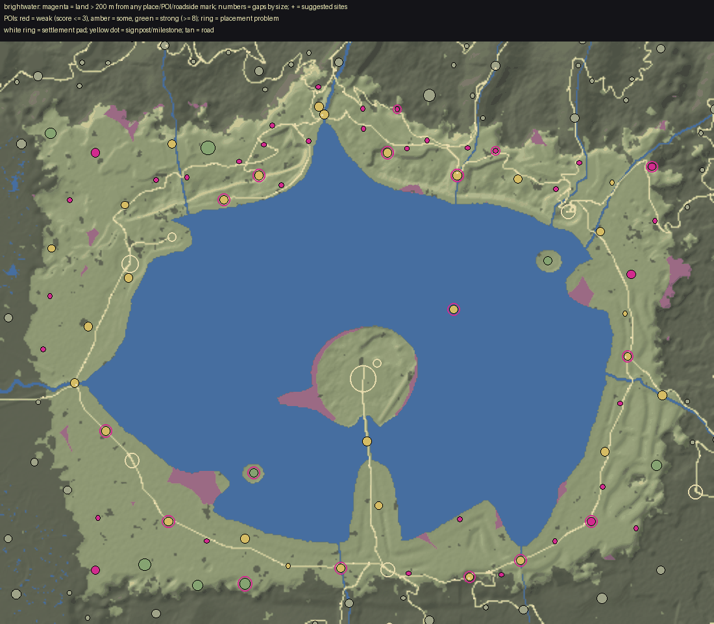

# World life audit: Brightwater

Made by `python3 tools/world/region_audit.py brightwater` from the installed world (2026-09-30T09:38:35Z) and the content pack; the POI measurements are `docs/review/world_life/probe_brightwater.json` (tools_gd/poi_probe.gd, headless). docs/WORLD_LIFE.md says how to read and use it.

## Summary

| | |
|---|---|
| land a body walks (dry, no steeper than 32 deg, 250 m in from the map's edge) | 4.7 km2 |
| points of interest | 72 (15.4 per km2; 2 not yet in the built world) |
| land more than 200 m from any place, POI or roadside mark | 0.13 km2 (3%); more than 400 m: 0% |
| share of land further than 100 / 150 / 200 / 300 / 400 m from anything | 40% / 14% / 3% / 0% / 0% |
| largest empty stretch | 0.00 km2 |
| weak POIs (score <= 3) | 5, and 30 wayside finds (small by design) |
| strong POIs (score >= 8) | 8 |
| placement problems | 27, at 17 POIs |

## (a) Empty land, largest first

A stretch is land of the region more than 200 m from the edge of every place's, POI's and roadside mark's pad. `furthest` is how far its middle is from anything. Sites are gentle ground (<= 14 deg) in it, as far from everything as it allows, nearer a road where one is near.

| # | middle (x, z) | km2 | extent m | furthest m | slope mean/p75 | height | province (biome) | road | sites (x, z, slope, road m) |
|---|---|---|---|---|---|---|---|---|---|

## (b) Points of interest, weakest first

Impact score, points for each: **size** footprint reach (m from the middle to its furthest piece): <8 = 0, <14 = 1, <22 = 2, <32 = 3, else 4; **things** interactables in the dressing (Hearthstone, touch, container, readable ...): 1 each, up to 3; **foes** an encounter that stands foes up: 1, and 1 more for 4 or more; **loot** something to take (an encounter's `lies`, a quest's item, a find): 1; **people** an NPC who lives or stands there: 1, 2 for two or more; **quest** a quest sends you there: 2; **interior** a door into an interior: 2; **landmark** a landmark model (a `scene` in pois.json): 2; **hearth** a Hearthstone: 1. **Weak** is 3 or under; **small** is a reach under 10 m. `reach` is metres from the middle to the furthest piece; `things` are interactables in the dressing (hearthstones, touches, containers); foes are the encounter's standing count; loot counts an encounter's `lies`, a find and a container.

| score | POI | kind | reach / pad m | pieces | draws | tris k | things | foes | loot | NPCs | quest | enc | interior | hearth | landmark | flags |
|---|---|---|---|---|---|---|---|---|---|---|---|---|---|---|---|---|
| 1 | The Serpent Watch `serpent_watch` | vista | 0 / 14 | 3 | 3 | 92 | 0 | 0 | 2 | 0 |  | yes |  |  |  | WEAK small wayside |
| 1 | Market Brow `market_brow` | vista | 0 / 14 | 3 | 3 | 92 | 0 | 0 | 2 | 0 |  | yes |  |  |  | WEAK small wayside |
| 1 | The Eggers' Cairn `eggers_cairn` | cairn | 0 / 14 | 5 | 5 | 111 | 0 | 0 | 2 | 0 |  | yes |  |  |  | WEAK small wayside |
| 1 | The Old Shoreline Cairn `old_shoreline_cairn` | cairn | 0 / 14 | 5 | 5 | 121 | 0 | 0 | 2 | 0 |  | yes |  |  |  | WEAK small wayside |
| 1 | The Thousand Post `the_thousand_post` | tally_post | 1 / 14 | 16 | 16 | 95 | 0 | 0 | 2 | 0 |  | yes |  |  |  | WEAK small wayside |
| 1 | The Lamp Niche `lamp_niche` | waystone | 2 / 14 | 7 | 7 | 1 | 0 | 0 | 4 | 0 |  | yes |  |  |  | WEAK small wayside |
| 1 | The Weight Stone `weight_stone` | waystone | 2 / 14 | 7 | 7 | 1 | 0 | 0 | 2 | 0 |  | yes |  |  |  | WEAK small wayside |
| 1 | The Burners' Spring `burners_spring` | well | 2 / 14 | 8 | 8 | 1 | 0 | 0 | 2 | 0 |  | yes |  |  |  | WEAK small wayside |
| 1 | The Rafters' Knots `rafters_knots` | shrine | 3 / 14 | 24 | 24 | 17 | 0 | 0 | 2 | 0 |  | yes |  |  |  | WEAK small wayside |
| 1 | The Weed-Cutters' Hut `weedcutters_hut` | hut | 4 / 14 | 7 | 7 | 3 | 0 | 0 | 2 | 0 |  | yes |  |  |  | WEAK small wayside |
| 1 | The Unsayers' Stones `unsayers` | standing_stones | 7 / 14 | 12 | 12 | 56 | 0 | 0 | 2 | 0 |  | yes |  |  |  | WEAK small wayside |
| 2 | The Hum Cairn `hum_cairn` | vista | 0 / 14 | 3 | 3 | 82 | 0 | 1 | 2 | 0 |  | yes |  |  |  | WEAK small wayside |
| 2 | The Fair-Day Stone `fair_day_stone` | waystone | 2 / 14 | 7 | 7 | 1 | 0 | 2 | 2 | 0 |  | yes |  |  |  | WEAK small wayside |
| 2 | The Charter's End `charters_end` | waystone | 2 / 14 | 7 | 7 | 2 | 0 | 2 | 2 | 0 |  | yes |  |  |  | WEAK small wayside |
| 2 | The Forgiving Stones `forgiving_stones` | shrine | 3 / 14 | 23 | 23 | 538 | 0 | 1 | 2 | 0 |  | yes |  |  |  | WEAK small wayside |
| 2 | The Pike Shrine `pike_shrine` | shrine | 3 / 14 | 24 | 24 | 17 | 0 | 2 | 2 | 0 |  | yes |  |  |  | WEAK small wayside |
| 2 | The False Lantern `the_false_lantern` | lantern_post | 6 / 14 | 17 | 17 | 9 | 0 | 1 | 2 | 0 |  | yes |  |  |  | WEAK small wayside |
| 2 | The Three Rights `three_rights` | standing_stones | 6 / 14 | 12 | 12 | 54 | 0 | 2 | 2 | 0 |  | yes |  |  |  | WEAK small wayside |
| 2 | The False-Light House `false_light_house` | ruins | 8 / 14 | 21 | 21 | 147 | 0 | 1 | 2 | 0 |  | yes |  |  |  | WEAK small wayside |
| 2 | The Reeve's Chair `reeves_chair` | shrine | 9 / 14 | 32 | 33 | 23 | 0 | 0 | 2 | 0 |  | yes |  |  |  | WEAK small wayside |
| 2 | Hesper's Boat `hespers_boat` | wreck | 11 / 14 | 32 | 32 | 65 | 0 | 0 | 2 | 0 |  | yes |  |  |  | WEAK wayside |
| 2 | The Beached Barge `beached_barge` | wreck | 11 / 25 | 38 | 40 | 80 | 0 | 0 | 2 | 0 |  | yes |  |  |  | WEAK |
| 2 | The Strandline Stones `strandline_stones` | standing_stones | 13 / 25 | 24 | 24 | 383 | 0 | 0 | 2 | 0 |  | yes |  |  |  | WEAK |
| 2 | The Drovers' Trough `drovers_trough` | camp | 14 / 14 | 74 | 74 | 67 | 0 | 0 | 2 | 0 |  | yes |  |  |  | WEAK wayside |
| 2 | The Listener's Tent `listeners_tent` | camp | 14 / 14 | 62 | 62 | 60 | 0 | 0 | 2 | 0 |  | yes |  |  |  | WEAK wayside |
| 3 | The Charter Stone `charter_stone` | standing_stones | 7 / 25 | 6 | 6 | 10 | 0 | 0 | 2 | 0 | yes | yes |  |  |  | WEAK small |
| 3 | The Salt Barn `salt_barn` | ruins | 10 / 14 | 21 | 21 | 140 | 0 | 2 | 2 | 0 |  | yes |  |  |  | WEAK wayside |
| 3 | The Priced Gibbet `the_priced_gibbet` | gibbet | 10 / 14 | 19 | 19 | 2 | 0 | 2 | 2 | 0 |  | yes |  |  |  | WEAK wayside |
| 3 | The Heronry `the_heronry` | tower | 11 / 25 | 9 | 9 | 168 | 0 | 0 | 0 | 0 | yes |  |  |  |  | WEAK |
| 3 | The Old Shore Bench `old_shore_bench` | vista | 11 / 14 | 10 | 10 | 94 | 0 | 2 | 2 | 0 |  | yes |  |  |  | WEAK wayside |
| 3 | The Carters' Rest `carters_rest` | vista | 11 / 14 | 10 | 10 | 94 | 0 | 1 | 2 | 0 |  | yes |  |  |  | WEAK wayside |
| 3 | The Laundry Punt `laundry_punt` | wreck | 11 / 14 | 28 | 28 | 64 | 0 | 1 | 2 | 0 |  | yes |  |  |  | WEAK wayside |
| 3 | The Toll Rope `toll_rope` | camp | 13 / 14 | 56 | 56 | 55 | 0 | 2 | 2 | 0 |  | yes |  |  |  | WEAK wayside |
| 3 | The Withy Camp `withy_camp` | camp | 14 / 14 | 56 | 56 | 55 | 0 | 0 | 2 | 0 |  | yes |  |  |  | WEAK wayside |
| 3 | The Smoke Coppice `smoke_coppice` | camp | 22 / 22 | 67 | 68 | 134 | 0 | 0 | 2 | 0 |  | yes |  |  |  | WEAK |
| 4 | The Dodgers' Stone `dodgers_stone` | waystone | 2 / 14 | 7 | 7 | 1 | 0 | 2 | 2 | 0 | yes | yes |  |  |  | small wayside |
| 4 | Shingle Shrine `shingle_shrine` | shrine | 3 / 25 | 30 | 30 | 538 | 1 | 0 | 0 | 0 | yes |  |  | yes |  | small |
| 4 | North Cliff Beacon `north_cliff_beacon` | tower | 7 / 25 | 15 | 15 | 73 | 0 | 3 | 2 | 0 | yes | yes |  |  |  | small |
| 4 | The Listening Post `the_listening_post` | tower | 8 / 25 | 18 | 18 | 54 | 0 | 0 | 2 | 1 | yes | yes |  |  |  | small |
| 4 | The Eggers' Camp `eggers_camp` | camp | 14 / 22 | 65 | 65 | 65 | 0 | 0 | 0 | 1 | yes |  |  |  |  |  |
| 4 | The Burner's Clamp `burners_clamp` | camp | 14 / 14 | 68 | 68 | 58 | 0 | 2 | 2 | 0 |  | yes |  |  |  | wayside |
| 4 | The Salvagers' Fire `salvagers_fire` | camp | 14 / 14 | 62 | 62 | 60 | 0 | 1 | 2 | 0 |  | yes |  |  |  | wayside |
| 4 | Brindle Mill `brindle_mill` | mill | 15 / 25 | 41 | 41 | 56 | 0 | 0 | 2 | 1 |  | yes |  |  |  |  |
| 4 | Skarl Mill `skarl_mill` | mill | 15 / 25 | 34 | 34 | 54 | 0 | 0 | 2 | 1 |  | yes |  |  |  |  |
| 4 | The Narrows Bridge `narrows_bridge` | bridge | 15 / 25 | 5 | 5 | 2 | 0 | 0 | 0 | 0 | yes |  |  |  |  |  |
| 4 | The Dry Jetty `dry_jetty` | bridge | 21 / 25 | 26 | 26 | 23 | 0 | 3 | 2 | 0 |  | yes |  |  |  |  |
| 4 | The Log Boom `log_boom` | bridge | 22 / 25 | 16 | 16 | 37 | 0 | 0 | 0 | 0 | yes |  |  |  |  |  |
| 5 | The Counting Tower `counting_tower` | tower | 10 / 25 | 18 | 18 | 54 | 0 | 0 | 2 | 1 | yes | yes |  |  |  | small |
| 5 | The Standing Arches `standing_arches` | ruins | 10 / 25 | 24 | 24 | 152 | 0 | 0 | 2 | 1 | yes | yes |  |  |  |  |
| 5 | The Gullhithe Wreck `gullhithe_wreck` | wreck | 12 / 25 | 32 | 32 | 65 | 0 | 5 | 0 | 0 | yes | yes |  |  |  |  |
| 5 | The Wash-Stones `wash_stones` | standing_stones | 14 / 25 | 29 | 29 | 32 | 0 | 0 | 2 | 1 | yes | yes |  |  |  |  |
| 5 | The Rafters' Camp `rafters_camp` | camp | 14 / 22 | 65 | 65 | 58 | 1 | 0 | 0 | 0 | yes |  |  |  |  |  |
| 5 | The Limekilns `the_limekilns` | camp | 15 / 22 | 71 | 71 | 59 | 1 | 0 | 0 | 0 | yes |  |  |  |  |  |
| 5 | The Eelweir `eelweir` | bridge | 16 / 25 | 20 | 20 | 131 | 0 | 3 | 0 | 0 | yes | yes |  |  |  |  |
| 5 | The Ness Market `ness_market` | camp | 17 / 22 | 70 | 70 | 98 | 0 | 0 | 2 | 2 |  | yes |  |  |  |  |
| 5 | The Tallyman's Folly `tallymans_folly` | ruins | 28 / 25 | 12 | 12 | 10 | 0 | 3 | 2 | 0 |  | yes |  |  |  |  |
| 5 | The Bell Buoys `buoy_bell_field` | strange | 48 / 25 | 7 | 7 | 66 | 0 | 0 | 2 | 0 |  | yes |  |  |  |  |
| 6 | The Net Field `net_field` | camp | 14 / 22 | 68 | 68 | 60 | 0 | 0 | 2 | 2 | yes | yes |  |  |  |  |
| 6 | The Sedge Hearth `sedge_hearth` | shrine | 16 / 25 | 46 | 46 | 20 | 1 | 0 | 0 | 0 | yes |  |  | yes |  |  |
| 6 | The Long Stride `long_stride` | bridge | 18 / 25 | 8 | 8 | 7 | 1 | 3 | 0 | 0 | yes | yes |  |  |  |  |
| 6 | The Larkmouth Bridge `larkmouth_bridge` | bridge | 43 / 25 | 8 | 8 | 7 | 0 | 0 | 0 | 0 | yes |  |  |  |  |  |
| 6 | The Stair Bridge `rudd_mouth_bridge` | bridge | 46 / 25 | 8 | 8 | 7 | 0 | 0 | 0 | 0 | yes |  |  |  |  |  |
| 6 | The Lime Bridge `lime_bridge` | bridge | 48 / 25 | 8 | 8 | 7 | 0 | 0 | 0 | 0 | yes |  |  |  |  |  |
| 6 | The Pilgrim Stair `pilgrim_stair` | ruins | 49 / 25 | 3 | 3 | 3 | 0 | 0 | 0 | 0 | yes |  |  |  |  |  |
| 8 | Willow Isle `willow_isle` | strange_tree | 56 / 25 | 28 | 29 | 20 | 0 | 0 | 2 | 1 | yes | yes |  |  |  |  |
| 9 | Gull Holm `gull_holm` | ruins | 14 / 25 | 24 | 24 | 147 | 1 | 4 | 2 | 0 | yes | yes | yes |  |  |  |
| 9 | The Bleaching Green `bleaching_green` | camp | 28 / 31 | 93 | 93 | 89 | 1 | 0 | 2 | 2 | yes | yes |  |  |  |  |
| 9 | The Cadbrae Slate Cut `cadbrae_slate_cut` | quarry | 29 / 30 | 29 | 29 | 37 | 0 | 3 | 2 | 2 | yes | yes |  |  |  |  |
| 11 | The Struck Barrow `the_struck_barrow` | delve | 29 / 30 | 18 | 18 | 16 | 2 | 4 | 0 | 0 | yes | yes | yes |  |  | unbuilt |
| 11 | Pennyfold Keep `pennyfold_keep` | fort | 34 / 34 | 139 | 139 | 105 | 2 | 0 | 2 | 0 | yes | yes | yes |  |  |  |
| 12 | The Hush Hole `the_hush_hole` | delve | 32 / 31 | 54 | 54 | 129 | 2 | 4 | 0 | 0 | yes | yes | yes |  |  |  |
| 12 | The Crown Drift `the_crown_drift` | delve | 41 / 40 | 51 | 51 | 73 | 2 | 3 | 0 | 1 | yes | yes | yes |  |  | unbuilt |

Weak POIs by kind (not wayside): standing_stones 2, wreck 1, tower 1, camp 1.

## (c) Placement problems

`seat:*` are the seat audit's findings over the POI's own pieces (tools_gd/seat_audit.gd: floating over the ground, buried, sunk, standing in a road's carriageway, overlapping another piece, a lamp or light hung from nothing; headless, so multimesh rows are not looked at). `past_pad`: pieces stand beyond the flattened pad, on the skirt or raw ground. `steep_skirt`: the pad's skirt (from its level core to its reach) falls at more than 33 deg along some line: a cut or an embankment. `steep_site`: a POI not yet built stands on ground sloping more than 18 deg on average under its pad. `overlap_pad`: two pads overlap. `road_through`: a road crosses the level core of a place that is not road furniture. `in_water`: its middle is in water.

Counts: steep_skirt 7, past_pad 7, road_through 7, seat:on_road 2, seat:overlap 2, seat:floating 1, seat:sunk 1.

| POI | problem | n | detail |
|---|---|---|---|
| `buoy_bell_field` | past_pad | 1 | pieces reach 48 m from its middle; its pad is 25 m |
| `larkmouth_bridge` | past_pad | 1 | pieces reach 43 m from its middle; its pad is 25 m |
| `lime_bridge` | past_pad | 1 | pieces reach 48 m from its middle; its pad is 25 m |
| `pilgrim_stair` | past_pad | 1 | pieces reach 49 m from its middle; its pad is 25 m |
| `rudd_mouth_bridge` | past_pad | 1 | pieces reach 46 m from its middle; its pad is 25 m |
| `tallymans_folly` | past_pad | 1 | pieces reach 28 m from its middle; its pad is 25 m |
| `willow_isle` | past_pad | 1 | pieces reach 56 m from its middle; its pad is 25 m |
| `north_cliff_beacon` | road_through | 1 | a road passes 0 m from its middle, inside its 18 m level core |
| `pilgrim_stair` | road_through | 1 | a road passes 0 m from its middle, inside its 18 m level core |
| `rafters_camp` | road_through | 1 | a road passes 0 m from its middle, inside its 15 m level core |
| `sedge_hearth` | road_through | 1 | a road passes 0 m from its middle, inside its 18 m level core |
| `strandline_stones` | road_through | 1 | a road passes 13 m from its middle, inside its 18 m level core |
| `tallymans_folly` | road_through | 1 | a road passes 2 m from its middle, inside its 18 m level core |
| `the_limekilns` | road_through | 1 | a road passes 0 m from its middle, inside its 15 m level core |
| `tallymans_folly` | seat:floating | 1 | hammer hearthvale_hammer_b.glb at (-1104, 522): 1.18 m over the ground |
| `north_cliff_beacon` | seat:on_road | 1 | drum Drum at (-560, -1470): stands in the carriageway of north_cliff_beacon_pilgrim_stair |
| `sedge_hearth` | seat:on_road | 1 | timber Timber at (-1439, 1): stands in the carriageway of sedgehithe_eelweir |
| `rafters_camp` | seat:overlap | 1 | campfire hearthvale_campfire_a.glb at (1564, -431): 100% of it shares its box with stool (poi:camp) |
| `willow_isle` | seat:overlap | 3 | willow_pollard brightwater_willow_pollard_b.glb at (-590, 240): 72% of it shares its box with campfire (poi:strange_tree) |
| `sedge_hearth` | seat:sunk | 1 | bell_medium cinderlea_bell_medium_a.glb at (-1432, -6): 86% of its 3.7 m under the ground at its middle |
| `bleaching_green` | steep_skirt | 1 | its pad's skirt falls at 44 deg: a cut or an embankment |
| `counting_tower` | steep_skirt | 1 | its pad's skirt falls at 56 deg: a cut or an embankment |
| `market_brow` | steep_skirt | 1 | its pad's skirt falls at 34 deg: a cut or an embankment |
| `north_cliff_beacon` | steep_skirt | 1 | its pad's skirt falls at 56 deg: a cut or an embankment |
| `reeves_chair` | steep_skirt | 1 | its pad's skirt falls at 33 deg: a cut or an embankment |
| `smoke_coppice` | steep_skirt | 1 | its pad's skirt falls at 51 deg: a cut or an embankment |
| `the_limekilns` | steep_skirt | 1 | its pad's skirt falls at 40 deg: a cut or an embankment |
