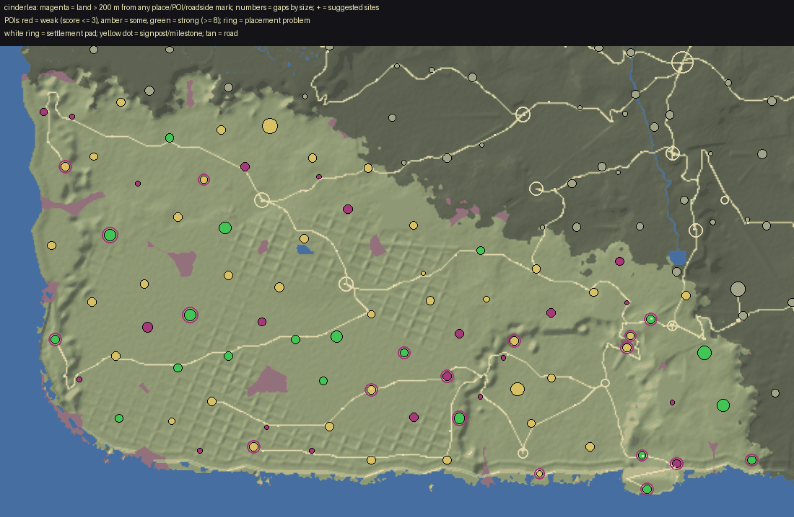

# World life audit: Cinderlea

Made by `python3 tools/world/region_audit.py cinderlea` from the installed world (2026-10-03T17:07:31Z) and the content pack; the POI measurements are `docs/review/world_life/probe_cinderlea.json` (tools_gd/poi_probe.gd, headless). docs/WORLD_LIFE.md says how to read and use it.

## Summary

| | |
|---|---|
| land a body walks (dry, no steeper than 32 deg, 250 m in from the map's edge) | 7.0 km2 |
| points of interest | 81 (11.5 per km2; 9 not yet in the built world) |
| land more than 200 m from any place, POI or roadside mark | 0.13 km2 (2%); more than 400 m: 0% |
| share of land further than 100 / 150 / 200 / 300 / 400 m from anything | 43% / 13% / 2% / 0% / 0% |
| largest empty stretch | 0.00 km2 |
| weak POIs (score <= 3) | 10, and 12 wayside finds (small by design) |
| strong POIs (score >= 8) | 20 |
| placement problems | 27, at 19 POIs |

## (a) Empty land, largest first

A stretch is land of the region more than 200 m from the edge of every place's, POI's and roadside mark's pad. `furthest` is how far its middle is from anything. Sites are gentle ground (<= 14 deg) in it, as far from everything as it allows, nearer a road where one is near.

| # | middle (x, z) | km2 | extent m | furthest m | slope mean/p75 | height | province (biome) | road | sites (x, z, slope, road m) |
|---|---|---|---|---|---|---|---|---|---|

## (b) Points of interest, weakest first

Impact score, points for each: **size** footprint reach (m from the middle to its furthest piece): <8 = 0, <14 = 1, <22 = 2, <32 = 3, else 4; **things** interactables in the dressing (Hearthstone, touch, container, readable ...): 1 each, up to 3; **foes** an encounter that stands foes up: 1, and 1 more for 4 or more; **loot** something to take (an encounter's `lies`, a quest's item, a find): 1; **people** an NPC who lives or stands there: 1, 2 for two or more; **quest** a quest sends you there: 2; **interior** a door into an interior: 2; **landmark** a landmark model (a `scene` in pois.json): 2; **hearth** a Hearthstone: 1. **Weak** is 3 or under; **small** is a reach under 10 m. `reach` is metres from the middle to the furthest piece; `things` are interactables in the dressing (hearthstones, touches, containers); foes are the encounter's standing count; loot counts an encounter's `lies`, a find and a container.

| score | POI | kind | reach / pad m | pieces | draws | tris k | things | foes | loot | NPCs | quest | enc | interior | hearth | landmark | flags |
|---|---|---|---|---|---|---|---|---|---|---|---|---|---|---|---|---|
| 1 | The Salt Road Cairn `salt_road_cairn` | vista | 0 / 14 | 3 | 3 | 65 | 0 | 0 | 2 | 0 |  | yes |  |  |  | WEAK small wayside |
| 1 | The First-Step Cairn `first_step_cairn` | cairn | 0 / 14 | 7 | 7 | 137 | 0 | 0 | 2 | 0 |  | yes |  |  |  | WEAK small wayside |
| 1 | The Half-Ash Cairn `half_ash_cairn` | cairn | 0 / 14 | 7 | 7 | 136 | 0 | 0 | 2 | 0 |  | yes |  |  |  | WEAK small wayside |
| 1 | The Scavenger's Grave `scavengers_grave` | grave | 2 / 14 | 8 | 8 | 51 | 0 | 0 | 2 | 0 |  | yes |  |  |  | WEAK small wayside |
| 1 | The Warden Under the Ash `warden_under_ash` | grave | 2 / 14 | 8 | 8 | 39 | 0 | 0 | 2 | 0 |  | yes |  |  |  | WEAK small wayside |
| 1 | The Glass-Road Stone `glass_road_stone` | waystone | 2 / 14 | 7 | 7 | 1 | 0 | 0 | 2 | 0 |  | yes |  |  |  | WEAK small wayside |
| 1 | The Last Meal Stone `last_meal_stone` | shrine | 3 / 14 | 24 | 24 | 17 | 0 | 0 | 4 | 0 |  | yes |  |  |  | WEAK small wayside |
| 1 | The Bowing Stones `bowing_stones` | standing_stones | 4 / 14 | 1 | 1 | 0 | 0 | 0 | 2 | 0 |  | yes |  |  |  | WEAK small wayside |
| 2 | The Silk Vents `silk_vents` | mill | 0 / 26 | 0 | 0 | 0 | 0 | 0 | 2 | 1 |  | yes |  |  |  | WEAK unbuilt not probed |
| 2 | The Fading-Glass `fading_glass` | strange | 0 / 24 | 0 | 0 | 0 | 0 | 1 | 2 | 0 |  | yes |  |  |  | WEAK unbuilt not probed |
| 2 | The Harbour Milestone `harbour_milestone` | waystone | 2 / 14 | 10 | 10 | 2 | 0 | 3 | 2 | 0 |  | yes |  |  |  | WEAK small wayside |
| 2 | The Turning Cairn `turning_cairn` | shrine | 3 / 25 | 20 | 20 | 13 | 0 | 0 | 0 | 0 | yes |  |  |  |  | WEAK small |
| 2 | The One Poppy `the_one_poppy` | strange | 5 / 25 | 16 | 16 | 140 | 1 | 0 | 2 | 0 |  | yes |  |  |  | WEAK small |
| 2 | The Robing-House `robing_house` | ruins | 8 / 14 | 21 | 21 | 112 | 0 | 0 | 2 | 0 |  | yes |  |  |  | WEAK small wayside |
| 2 | The Tower-Road Bell `tower_road_bell` | shrine | 8 / 14 | 29 | 29 | 15 | 0 | 0 | 2 | 0 |  | yes |  |  |  | WEAK small wayside |
| 3 | The Ash Dial `the_ash_dial` | strange | 0 / 30 | 0 | 0 | 0 | 0 | 4 | 0 | 1 |  | yes |  |  |  | WEAK unbuilt not probed |
| 3 | The Name-Kiln `name_kiln` | hut | 0 / 26 | 0 | 0 | 0 | 0 | 0 | 0 | 1 | yes |  |  |  |  | WEAK unbuilt not probed |
| 3 | The Smoke-Speakers' Hood `smoke_hood` | beacon | 0 / 26 | 0 | 0 | 0 | 0 | 0 | 0 | 1 | yes |  |  |  |  | WEAK unbuilt not probed |
| 3 | The Leaving-Lines `leaving_lines` | strange | 0 / 26 | 0 | 0 | 0 | 0 | 0 | 0 | 1 | yes |  |  |  |  | WEAK unbuilt not probed |
| 3 | The Gentle Fold `gentle_fold` | fold | 0 / 24 | 0 | 0 | 0 | 0 | 0 | 0 | 1 | yes |  |  |  |  | WEAK unbuilt not probed |
| 3 | The Bell Wood Stone `bell_wood_stone` | shrine | 4 / 25 | 27 | 27 | 13 | 1 | 0 | 2 | 0 |  | yes |  | yes |  | WEAK small |
| 3 | The Salt Hulk `salt_hulk` | wreck | 17 / 21 | 36 | 36 | 41 | 0 | 0 | 2 | 0 |  | yes |  |  |  | WEAK wayside |
| 4 | The Unrung Graves `unrung_graves` | grave | 2 / 20 | 8 | 8 | 39 | 0 | 1 | 2 | 0 | yes | yes |  |  |  | small |
| 4 | The Tenth Waystone `tenth_waystone` | waystone | 2 / 25 | 7 | 7 | 1 | 0 | 2 | 2 | 0 | yes | yes |  |  |  | small |
| 4 | The Bell-Counter's Hut `bell_counters_hut` | hut | 5 / 18 | 10 | 10 | 8 | 0 | 0 | 2 | 1 | yes | yes |  |  |  | small |
| 4 | Greywatch `greywatch` | standing_stones | 8 / 25 | 19 | 19 | 6 | 1 | 0 | 0 | 0 | yes |  |  |  |  | small |
| 4 | The Ninth Waystone `ninth_waystone` | standing_stones | 8 / 25 | 6 | 6 | 4 | 1 | 0 | 0 | 0 | yes |  |  |  |  | small |
| 4 | The Grey Hedge `grey_hedge` | ruins | 9 / 25 | 5 | 7 | 97 | 0 | 0 | 2 | 0 | yes | yes |  |  |  | small |
| 4 | The Pilgrims' Bell `bell_of_the_pilgrims` | shrine | 12 / 25 | 36 | 36 | 16 | 1 | 0 | 2 | 0 |  | yes |  | yes |  |  |
| 4 | The Driftwood Camp `driftwood_camp` | camp | 13 / 22 | 56 | 56 | 58 | 0 | 0 | 2 | 0 | yes | yes |  |  |  |  |
| 4 | Ashcombe Mill `ashcombe_mill` | mill | 13 / 25 | 33 | 33 | 43 | 1 | 2 | 2 | 0 |  | yes |  |  |  |  |
| 4 | Greyfleece Shieling `greyfleece_shieling` | shieling | 14 / 25 | 11 | 11 | 39 | 0 | 0 | 0 | 1 | yes |  |  |  |  |  |
| 5 | Cinderhowe `cinderhowe` | delve | 0 / 44 | 0 | 0 | 0 | 0 | 0 | 0 | 1 | yes |  | yes |  |  | unbuilt not probed |
| 5 | The Last Hearth `last_hearth` | shrine | 4 / 25 | 31 | 31 | 16 | 1 | 0 | 2 | 0 | yes | yes |  | yes |  | small |
| 5 | Sulion `sulion` | tower | 13 / 25 | 4 | 4 | 51 | 0 | 1 | 2 | 0 | yes | yes |  |  |  |  |
| 5 | The Last Milestone `last_milestone` | standing_stones | 14 / 25 | 4 | 4 | 0 | 0 | 2 | 2 | 0 | yes | yes |  |  |  |  |
| 5 | The Headless Watch `headless_watch` | tower | 14 / 25 | 13 | 13 | 83 | 0 | 1 | 0 | 1 | yes | yes |  |  |  |  |
| 5 | The Sweeper's Lean-To `sweepers_lean_to` | camp | 15 / 22 | 62 | 62 | 59 | 0 | 0 | 0 | 1 | yes |  |  |  |  |  |
| 5 | The Scavengers' Cold Camp `scavengers_cold_camp` | camp | 15 / 14 | 84 | 84 | 64 | 1 | 2 | 4 | 0 |  | yes |  |  |  | wayside |
| 5 | The Grey Wreck `grey_wreck` | wreck | 18 / 25 | 36 | 36 | 41 | 0 | 3 | 0 | 0 | yes | yes |  |  |  |  |
| 5 | The Greyline Stones `greyline_stones` | standing_stones | 18 / 25 | 4 | 5 | 1 | 1 | 0 | 0 | 0 | yes |  |  |  |  |  |
| 5 | The Row of Mouths `row_of_mouths` | ruins | 20 / 25 | 3 | 5 | 30 | 1 | 2 | 2 | 0 |  | yes |  |  |  |  |
| 5 | The Glass Falls `glass_falls` | waterfall | 23 / 25 | 21 | 21 | 273 | 0 | 1 | 2 | 0 |  | yes |  |  |  |  |
| 5 | The Kneeling Colossus `kneeling_colossus` | ruins | 38 / 25 | 35 | 35 | 102 | 0 | 0 | 2 | 0 |  | yes |  |  |  |  |
| 6 | The Hermit's Gate `hermits_gate` | ruins | 10 / 25 | 16 | 17 | 43 | 1 | 0 | 2 | 1 | yes | yes |  |  |  |  |
| 6 | The Novices' Seats `novices_seats` | standing_stones | 12 / 25 | 6 | 6 | 2 | 1 | 0 | 2 | 1 | yes | yes |  |  |  |  |
| 6 | The Strand Beacon `strand_beacon` | tower | 12 / 25 | 7 | 7 | 31 | 2 | 0 | 1 | 0 | yes |  |  |  |  |  |
| 6 | The Salt Landing `salt_landing` | camp | 13 / 26 | 50 | 50 | 58 | 1 | 0 | 0 | 2 | yes |  |  |  |  |  |
| 6 | The Cold Fire `cold_fire_camp` | camp | 13 / 22 | 96 | 96 | 68 | 1 | 6 | 0 | 0 | yes | yes |  |  |  |  |
| 6 | Hesk-Morn `hesk_morn` | ruins | 14 / 25 | 5 | 5 | 23 | 1 | 0 | 2 | 0 | yes | yes |  |  |  |  |
| 6 | The Anthem Hall `anthem_hall` | ruins | 21 / 25 | 12 | 12 | 29 | 2 | 2 | 3 | 0 |  | yes |  |  |  |  |
| 6 | The Last Furrow `ploughed_ash` | farmstead | 22 / 28 | 42 | 42 | 42 | 0 | 4 | 2 | 0 |  | yes |  |  |  |  |
| 6 | The Bell Garden `bell_garden` | ruins | 23 / 25 | 5 | 5 | 128 | 1 | 1 | 2 | 0 |  | yes |  |  |  |  |
| 6 | Hesk Pool `hesk_pool` | ruins | 27 / 25 | 4 | 4 | 34 | 1 | 0 | 0 | 0 | yes |  |  |  |  |  |
| 6 | The Sunk Plaza `sunk_plaza` | ruins | 31 / 25 | 22 | 22 | 192 | 1 | 2 | 2 | 0 |  | yes |  |  |  |  |
| 6 | The Tide Mouth `hushline_cave` | cave | 36 / 18 | 49 | 49 | 148 | 0 | 3 | 2 | 0 |  | yes |  |  |  |  |
| 7 | The Fallen Head `the_fallen_head` | delve | 0 / 40 | 0 | 0 | 0 | 0 | 4 | 0 | 1 | yes | yes | yes |  |  | unbuilt not probed |
| 7 | The Tower of Vaelost `tower_of_vaelost` | tower | 16 / 25 | 6 | 6 | 44 | 1 | 1 | 2 | 0 | yes | yes |  |  |  |  |
| 7 | The Bell Pit `bell_pit` | ruins | 20 / 25 | 26 | 26 | 39 | 1 | 2 | 1 | 0 | yes | yes |  |  |  |  |
| 7 | The North Gate `north_gate` | ruins | 22 / 25 | 13 | 13 | 50 | 1 | 2 | 0 | 0 | yes | yes |  |  |  |  |
| 7 | The Sayers' Gauge `sayers_gauge` | watchtower | 28 / 22 | 131 | 131 | 97 | 0 | 0 | 2 | 1 | yes | yes |  |  |  |  |
| 8 | The Silent Market `silent_market` | ruins | 18 / 25 | 25 | 25 | 84 | 2 | 3 | 1 | 0 | yes | yes |  |  |  |  |
| 8 | The Weighhouse `weighhouse` | ruins | 26 / 25 | 13 | 13 | 56 | 2 | 0 | 3 | 0 | yes | yes |  |  |  |  |
| 8 | The Builders' Harbour `builders_harbour` | ruins | 27 / 25 | 11 | 11 | 74 | 2 | 0 | 1 | 0 | yes |  |  |  |  |  |
| 8 | The Hush Bell `hush_bell` | tower | 27 / 25 | 5 | 8 | 34 | 1 | 2 | 2 | 0 | yes | yes |  |  |  |  |
| 8 | The Thirteenth `thirteenth_colossus` | ruins | 38 / 42 | 35 | 35 | 107 | 0 | 3 | 2 | 2 |  | yes |  |  |  |  |
| 8 | The Hushline Stair `hushline_stair` | hidden_valley | 64 / 26 | 27 | 27 | 13 | 1 | 4 | 0 | 0 |  | yes |  | yes |  |  |
| 8 | The Glass Bridge `glass_bridge` | bridge | 67 / 25 | 14 | 14 | 58 | 0 | 4 | 0 | 0 | yes | yes |  |  |  |  |
| 9 | The Rooftop Shaft `rooftop_shaft` | delve | 16 / 24 | 29 | 29 | 39 | 2 | 2 | 0 | 0 | yes | yes | yes |  |  |  |
| 9 | Bell Street `bell_street` | ruins | 24 / 25 | 20 | 20 | 59 | 2 | 3 | 1 | 0 | yes | yes |  |  |  |  |
| 9 | The Ash-Winter Carts `ashwinter_carts` | ruins | 25 / 25 | 30 | 30 | 48 | 2 | 3 | 1 | 0 | yes | yes |  |  |  |  |
| 9 | The Bell-Rope Walk `bellrope_walk` | camp | 32 / 36 | 30 | 30 | 74 | 1 | 0 | 0 | 2 | yes |  |  |  |  |  |
| 9 | The Scavengers' Ring `scavengers_ring` | walled_camp | 33 / 24 | 128 | 128 | 98 | 0 | 0 | 2 | 2 | yes | yes |  |  |  |  |
| 9 | The Stair Head `stair_head` | camp | 445 / 22 | 367 | 367 | 266 | 2 | 0 | 0 | 0 | yes |  |  | yes |  |  |
| 10 | Ashcombe `ashcombe` | ruins | 27 / 25 | 22 | 22 | 30 | 2 | 4 | 1 | 0 | yes | yes |  |  |  |  |
| 10 | The Kilnway `the_kilnway` | delve | 51 / 34 | 28 | 28 | 283 | 2 | 0 | 0 | 0 | yes |  | yes |  |  |  |
| 11 | The Undertone `the_undertone` | delve | 30 / 31 | 23 | 23 | 44 | 2 | 3 | 0 | 1 | yes | yes | yes |  |  |  |
| 11 | Chalkwatch `chalkwatch` | fort | 32 / 36 | 158 | 160 | 144 | 2 | 0 | 0 | 1 | yes |  | yes |  |  |  |
| 11 | Turnback Keep `turnback_keep` | castle_ruin | 39 / 34 | 154 | 154 | 140 | 2 | 0 | 0 | 1 | yes |  | yes |  |  |  |
| 12 | The Cistern of Isse `cistern_of_isse` | ruins | 22 / 25 | 12 | 12 | 34 | 2 | 2 | 2 | 1 | yes | yes | yes |  |  |  |
| 13 | The Founders' Delf `founders_delf` | delve | 28 / 34 | 36 | 37 | 78 | 4 | 3 | 1 | 1 | yes | yes | yes |  |  |  |

Weak POIs by kind (not wayside): strange 4, shrine 2, hut 1, beacon 1, mill 1, fold 1.

## (c) Placement problems

`seat:*` are the seat audit's findings over the POI's own pieces (tools_gd/seat_audit.gd: floating over the ground, buried, sunk, standing in a road's carriageway, overlapping another piece, a lamp or light hung from nothing; headless, so multimesh rows are not looked at). `past_pad`: pieces stand beyond the flattened pad, on the skirt or raw ground. `steep_skirt`: the pad's skirt (from its level core to its reach) falls at more than 33 deg along some line: a cut or an embankment. `steep_site`: a POI not yet built stands on ground sloping more than 18 deg on average under its pad. `overlap_pad`: two pads overlap. `road_through`: a road crosses the level core of a place that is not road furniture. `in_water`: its middle is in water.

Counts: past_pad 11, steep_skirt 8, seat:floating 3, road_through 3, seat:buried 1, seat:sunk 1.

| POI | problem | n | detail |
|---|---|---|---|
| `glass_bridge` | past_pad | 1 | pieces reach 67 m from its middle; its pad is 25 m |
| `hush_bell` | past_pad | 1 | pieces reach 27 m from its middle; its pad is 25 m |
| `hushline_cave` | past_pad | 1 | pieces reach 36 m from its middle; its pad is 18 m |
| `hushline_stair` | past_pad | 1 | pieces reach 64 m from its middle; its pad is 26 m |
| `kneeling_colossus` | past_pad | 1 | pieces reach 38 m from its middle; its pad is 25 m |
| `sayers_gauge` | past_pad | 1 | pieces reach 28 m from its middle; its pad is 22 m |
| `scavengers_ring` | past_pad | 1 | pieces reach 33 m from its middle; its pad is 24 m |
| `stair_head` | past_pad | 1 | pieces reach 445 m from its middle; its pad is 22 m |
| `sunk_plaza` | past_pad | 1 | pieces reach 31 m from its middle; its pad is 25 m |
| `the_kilnway` | past_pad | 1 | pieces reach 51 m from its middle; its pad is 34 m |
| `turnback_keep` | past_pad | 1 | pieces reach 39 m from its middle; its pad is 34 m |
| `hushline_stair` | road_through | 1 | a road passes 0 m from its middle, inside its 18 m level core |
| `sweepers_lean_to` | road_through | 1 | a road passes 2 m from its middle, inside its 15 m level core |
| `the_one_poppy` | road_through | 1 | a road passes 4 m from its middle, inside its 18 m level core |
| `hushline_cave` | seat:buried | 5 | throat1 Throat1 at (-593, 3766): all of it under the ground (top 52.97 m below the lowest ground under it) |
| `glass_falls` | seat:floating | 1 | stream Stream at (-88, 3039): 0.21 m over the ground |
| `headless_watch` | seat:floating | 1 | eyes Eyes at (-753, 2986): 2.56 m over the ground |
| `stair_head` | seat:floating | 1 | @meshinstance3d@6127 @MeshInstance3D@6127 at (-7, 3670): 1.77 m over the ground |
| `hushline_cave` | seat:sunk | 6 | boulder cinderlea_boulder_a.glb at (-590, 3771): 360% of its 7.0 m under the ground at its middle |
| `builders_harbour` | steep_skirt | 1 | its pad's skirt falls at 33 deg: a cut or an embankment |
| `glass_falls` | steep_skirt | 1 | its pad's skirt falls at 46 deg: a cut or an embankment |
| `headless_watch` | steep_skirt | 1 | its pad's skirt falls at 52 deg: a cut or an embankment |
| `hushline_cave` | steep_skirt | 1 | its pad's skirt falls at 81 deg: a cut or an embankment |
| `strand_beacon` | steep_skirt | 1 | its pad's skirt falls at 43 deg: a cut or an embankment |
| `sweepers_lean_to` | steep_skirt | 1 | its pad's skirt falls at 37 deg: a cut or an embankment |
| `the_undertone` | steep_skirt | 1 | its pad's skirt falls at 54 deg: a cut or an embankment |
| `turning_cairn` | steep_skirt | 1 | its pad's skirt falls at 73 deg: a cut or an embankment |
