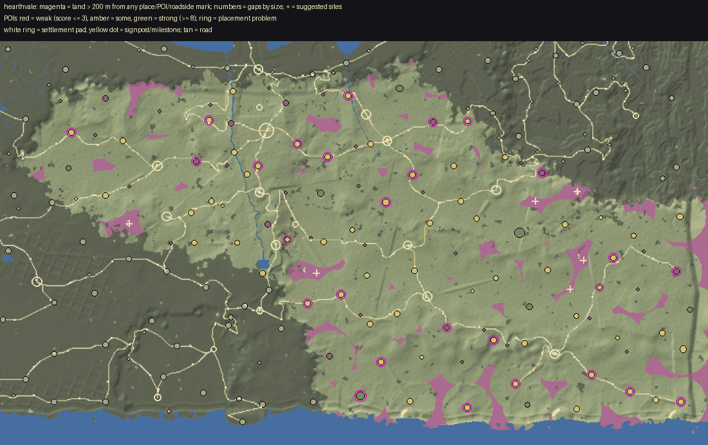

# World life audit: Hearthvale

Made by `python3 tools/world/region_audit.py hearthvale` from the installed world (2026-09-28T18:00:36Z) and the content pack; the POI measurements are `docs/review/world_life/probe_hearthvale.json` (tools_gd/poi_probe.gd, headless). docs/WORLD_LIFE.md says how to read and use it.

## Summary

| | |
|---|---|
| land a body walks (dry, no steeper than 32 deg, 250 m in from the map's edge) | 10.9 km2 |
| points of interest | 104 (9.5 per km2; 17 not yet in the built world) |
| land more than 200 m from any place, POI or roadside mark | 0.62 km2 (6%); more than 400 m: 0% |
| share of land further than 100 / 150 / 200 / 300 / 400 m from anything | 54% / 25% / 6% / 0% / 0% |
| largest empty stretch | 0.05 km2 |
| weak POIs (score <= 3) | 10, and 25 wayside finds (small by design) |
| strong POIs (score >= 8) | 8 |
| placement problems | 30, at 27 POIs |

## (a) Empty land, largest first

A stretch is land of the region more than 200 m from the edge of every place's, POI's and roadside mark's pad. `furthest` is how far its middle is from anything. Sites are gentle ground (<= 14 deg) in it, as far from everything as it allows, nearer a road where one is near.

| # | middle (x, z) | km2 | extent m | furthest m | slope mean/p75 | height | province (biome) | road | sites (x, z, slope, road m) |
|---|---|---|---|---|---|---|---|---|---|
| 1 | (2972, 2428) | 0.05 | 344 x 560 | 276 | 8 / 10 | 121 | Hound Down and the Brow (downs), Rook Wood | nearest 149 m | (3012, 2460) 1 deg 201 m; (2892, 2716) 2 deg 204 m |
| 2 | (-948, 2140) | 0.05 | 384 x 256 | 288 | 6 / 8 | 57 | The West Downs (downs) | nearest 197 m | (-948, 2140) 1 deg 304 m |
| 3 | (2964, 1868) | 0.05 | 576 x 256 | 283 | 12 / 16 | 81 | The East Downs (downs) | nearest 168 m | (2956, 1860) 2 deg 300 m; (2588, 1948) 2 deg 216 m |
| 4 | (580, 2548) | 0.05 | 488 x 200 | 270 | 8 / 11 | 121 | Hound Down and the Brow (downs) | nearest 144 m | (684, 2572) 1 deg 233 m |

## (b) Points of interest, weakest first

Impact score, points for each: **size** footprint reach (m from the middle to its furthest piece): <8 = 0, <14 = 1, <22 = 2, <32 = 3, else 4; **things** interactables in the dressing (Hearthstone, touch, container, readable ...): 1 each, up to 3; **foes** an encounter that stands foes up: 1, and 1 more for 4 or more; **loot** something to take (an encounter's `lies`, a quest's item, a find): 1; **people** an NPC who lives or stands there: 1, 2 for two or more; **quest** a quest sends you there: 2; **interior** a door into an interior: 2; **landmark** a landmark model (a `scene` in pois.json): 2; **hearth** a Hearthstone: 1. **Weak** is 3 or under; **small** is a reach under 10 m. `reach` is metres from the middle to the furthest piece; `things` are interactables in the dressing (hearthstones, touches, containers); foes are the encounter's standing count; loot counts an encounter's `lies`, a find and a container.

| score | POI | kind | reach / pad m | pieces | draws | tris k | things | foes | loot | NPCs | quest | enc | interior | hearth | landmark | flags |
|---|---|---|---|---|---|---|---|---|---|---|---|---|---|---|---|---|
| 1 | The Grey-Wind Cairn `grey_wind_cairn` | vista | 0 / 14 | 3 | 3 | 71 | 0 | 0 | 2 | 0 |  | yes |  |  |  | WEAK small wayside |
| 1 | The Ploughman's Grave `ploughmans_grave` | grave | 2 / 14 | 7 | 7 | 3 | 0 | 0 | 2 | 0 |  | yes |  |  |  | WEAK small wayside |
| 1 | The Last Dry Mile `last_dry_mile` | waystone | 2 / 14 | 7 | 7 | 1 | 0 | 0 | 2 | 0 |  | yes |  |  |  | WEAK small wayside |
| 1 | The Quiet Mile `quiet_mile` | waystone | 2 / 14 | 7 | 7 | 2 | 0 | 0 | 2 | 0 |  | yes |  |  |  | WEAK small wayside |
| 1 | Ansel's Dew-Well `ansels_dew_well` | well | 2 / 14 | 11 | 11 | 15 | 0 | 0 | 2 | 0 |  | yes |  |  |  | WEAK small wayside |
| 1 | The Naming Well `naming_well` | well | 2 / 14 | 11 | 11 | 15 | 0 | 0 | 2 | 0 |  | yes |  |  |  | WEAK small wayside |
| 1 | The Millers' Stone `millers_stone` | waystone | 2 / 14 | 10 | 10 | 2 | 0 | 0 | 2 | 0 |  | yes |  |  |  | WEAK small wayside |
| 1 | The Mill-Down Fold `mill_down_fold` | fold | 5 / 14 | 33 | 33 | 48 | 0 | 0 | 2 | 0 |  | yes |  |  |  | WEAK small wayside |
| 1 | The Barrow-Flock Fold `barrow_flock_fold` | fold | 6 / 14 | 36 | 36 | 51 | 0 | 0 | 2 | 0 |  | yes |  |  |  | WEAK small wayside |
| 1 | The Hare Stone `hare_stone` | standing_stones | 6 / 25 | 12 | 12 | 51 | 0 | 0 | 2 | 0 |  | yes |  |  |  | WEAK small |
| 1 | The Garrison Shrine `garrison_shrine` | shrine | 6 / 14 | 33 | 33 | 19 | 0 | 0 | 2 | 0 |  | yes |  |  |  | WEAK small wayside |
| 1 | The Hound's Bowl `hounds_bowl` | shrine | 6 / 14 | 33 | 33 | 20 | 0 | 0 | 2 | 0 |  | yes |  |  |  | WEAK small wayside |
| 1 | The Cider Shrine `cider_shrine` | shrine | 6 / 14 | 33 | 33 | 20 | 0 | 0 | 2 | 0 |  | yes |  |  |  | WEAK small wayside |
| 1 | The Weighing Stone `the_weighing_stone` | standing_stones | 6 / 25 | 12 | 12 | 49 | 0 | 0 | 2 | 0 |  | yes |  |  |  | WEAK small |
| 1 | The Gossip Stones `gossip_stones` | standing_stones | 7 / 14 | 12 | 12 | 51 | 0 | 0 | 2 | 0 |  | yes |  |  |  | WEAK small wayside |
| 1 | The Brow Lichen Ring `brow_lichen_ring` | standing_stones | 7 / 14 | 15 | 15 | 51 | 0 | 0 | 2 | 0 |  | yes |  |  |  | WEAK small wayside |
| 1 | The Chalk Cell `chalk_cell` | ruins | 8 / 25 | 21 | 21 | 126 | 0 | 0 | 2 | 0 |  | yes |  |  |  | WEAK small |
| 2 | The Southgate Stone `southgate_stone` | shrine | 6 / 25 | 40 | 40 | 20 | 1 | 0 | 0 | 0 |  |  |  | yes |  | WEAK small |
| 2 | The Roll Stone `roll_stone` | standing_stones | 6 / 25 | 12 | 12 | 49 | 0 | 0 | 0 | 0 | yes |  |  |  |  | WEAK small |
| 2 | The Rubbing Stones `rubbing_stones` | standing_stones | 7 / 14 | 12 | 12 | 49 | 0 | 2 | 2 | 0 |  | yes |  |  |  | WEAK small wayside |
| 2 | The Naming Stone `the_naming_stone` | shrine | 7 / 25 | 40 | 40 | 19 | 1 | 0 | 0 | 0 |  |  |  | yes |  | WEAK small |
| 2 | Bell Meadow Stones `bell_meadow_stones` | standing_stones | 9 / 25 | 19 | 19 | 53 | 0 | 0 | 2 | 0 |  | yes |  |  |  | WEAK small |
| 2 | The Hayward's Perch `haywards_perch` | tower | 9 / 25 | 15 | 15 | 20 | 0 | 0 | 2 | 0 |  | yes |  |  |  | WEAK small |
| 2 | The Turned Hut `turned_hut` | ruins | 10 / 25 | 21 | 21 | 126 | 0 | 0 | 2 | 0 |  | yes |  |  |  | WEAK |
| 2 | Toll View `toll_view` | vista | 11 / 14 | 10 | 10 | 74 | 0 | 0 | 2 | 0 |  | yes |  |  |  | WEAK wayside |
| 2 | Ribbon Meg's Fire `ribbon_megs_fire` | camp | 13 / 14 | 56 | 56 | 52 | 0 | 0 | 2 | 0 |  | yes |  |  |  | WEAK wayside |
| 3 | The Malting Floor `malting_floor` | ruins | 10 / 14 | 21 | 21 | 122 | 0 | 2 | 2 | 0 |  | yes |  |  |  | WEAK small wayside |
| 3 | The Dole-House `dole_house` | ruins | 10 / 14 | 12 | 12 | 112 | 0 | 1 | 2 | 0 |  | yes |  |  |  | WEAK small wayside |
| 3 | The Lone Barrow `lone_barrow` | ruins | 10 / 14 | 12 | 12 | 116 | 0 | 1 | 2 | 0 |  | yes |  |  |  | WEAK wayside |
| 3 | The Long Table Bench `long_table_bench` | vista | 11 / 14 | 10 | 10 | 73 | 0 | 1 | 2 | 0 |  | yes |  |  |  | WEAK wayside |
| 3 | The Drove Gate Toll `drove_gate_toll` | camp | 13 / 14 | 68 | 68 | 62 | 0 | 3 | 2 | 0 |  | yes |  |  |  | WEAK wayside |
| 3 | The Wardens' Halt `wardens_halt` | camp | 13 / 14 | 74 | 74 | 64 | 0 | 2 | 2 | 0 |  | yes |  |  |  | WEAK wayside |
| 3 | Gorse Hut `gorse_hut` | shieling | 13 / 14 | 11 | 11 | 31 | 0 | 3 | 2 | 0 |  | yes |  |  |  | WEAK wayside |
| 3 | The Boys' Lookout `boys_lookout` | camp | 14 / 14 | 68 | 68 | 62 | 0 | 2 | 2 | 0 |  | yes |  |  |  | WEAK wayside |
| 3 | Pennywort Bridge `pennywort_bridge` | bridge | 19 / 25 | 8 | 8 | 6 | 0 | 0 | 2 | 0 |  | yes |  |  |  | WEAK |
| 4 | Ash Watch `ash_watch` | tower | 6 / 25 | 15 | 15 | 69 | 0 | 0 | 2 | 1 | yes | yes |  |  |  | small |
| 4 | The Wellspring `the_wellspring` | shrine | 6 / 25 | 43 | 43 | 35 | 1 | 0 | 0 | 0 | yes |  |  | yes |  | small |
| 4 | Hound Watch `hound_watch` | tower | 6 / 25 | 15 | 15 | 69 | 0 | 0 | 2 | 1 | yes | yes |  |  |  | small |
| 4 | Candle Cross `candle_cross` | shrine | 6 / 25 | 40 | 40 | 20 | 1 | 0 | 0 | 0 | yes |  |  | yes |  | small |
| 4 | The Cliff Hearth `cliff_hearth` | shrine | 6 / 25 | 40 | 40 | 20 | 1 | 0 | 2 | 1 |  | yes |  | yes |  | small |
| 4 | The Brow Beacon `brow_beacon` | tower | 7 / 25 | 15 | 15 | 69 | 0 | 0 | 2 | 1 | yes | yes |  |  |  | small |
| 4 | Hushwatch `hushwatch_stones` | standing_stones | 7 / 25 | 12 | 12 | 51 | 1 | 0 | 4 | 0 | yes | yes |  |  |  | small |
| 4 | Wolf Holt `wolf_holt` | ruins | 8 / 25 | 21 | 21 | 123 | 0 | 3 | 2 | 0 | yes | yes |  |  |  | small |
| 4 | The Rookdown Bee-Garth `rookdown_bee_garth` | fold | 8 / 16 | 10 | 10 | 59 | 2 | 0 | 3 | 1 |  | yes |  |  |  | small unbuilt |
| 4 | The Grey End `the_grey_end` | ruins | 8 / 25 | 5 | 7 | 94 | 0 | 3 | 2 | 1 |  | yes |  |  |  | small |
| 4 | Orm's Long Barrow `orms_long_barrow` | ruins | 8 / 25 | 12 | 12 | 116 | 0 | 2 | 0 | 0 | yes | yes |  |  |  | small |
| 4 | The Warden Barrow `warden_barrow` | ruins | 9 / 25 | 12 | 12 | 112 | 0 | 0 | 2 | 0 | yes | yes |  |  |  | small |
| 4 | Lamb's Bottom `lambs_bottom` | ruins | 9 / 25 | 21 | 21 | 126 | 0 | 4 | 2 | 0 |  | yes |  |  |  | small |
| 4 | The Old Sheepwash `old_sheepwash` | ruins | 9 / 25 | 21 | 21 | 123 | 0 | 0 | 2 | 0 | yes | yes |  |  |  | small |
| 4 | The Struck Gibbet `struck_gibbet` | gibbet | 9 / 16 | 14 | 14 | 2 | 1 | 2 | 2 | 0 |  | yes |  |  |  | small unbuilt |
| 4 | Whitecut Falls `whitecut_falls` | waterfall | 10 / 25 | 14 | 14 | 200 | 0 | 4 | 2 | 0 |  | yes |  |  |  | small |
| 4 | The Pinfold `the_pinfold` | ruins | 10 / 25 | 21 | 21 | 126 | 0 | 0 | 2 | 0 | yes | yes |  |  |  | small |
| 4 | Tallow Barrow `tallow_barrow` | ruins | 10 / 25 | 12 | 12 | 116 | 0 | 3 | 0 | 0 | yes | yes |  |  |  |  |
| 4 | The Cliff Graves `cliff_graves` | ruins | 10 / 25 | 12 | 12 | 112 | 0 | 0 | 2 | 0 | yes | yes |  |  |  |  |
| 4 | The Last Look `last_look` | vista | 11 / 25 | 10 | 10 | 74 | 0 | 0 | 2 | 0 | yes | yes |  |  |  |  |
| 4 | The Singing Yew `singing_yew` | strange_tree | 12 / 25 | 22 | 23 | 28 | 0 | 2 | 0 | 0 | yes | yes |  |  |  |  |
| 4 | Rook Mill `rook_mill` | mill | 13 / 25 | 31 | 31 | 42 | 0 | 1 | 0 | 0 | yes | yes |  |  |  |  |
| 4 | Hurdle Fold `hurdle_fold` | camp | 14 / 22 | 74 | 74 | 65 | 0 | 3 | 0 | 1 |  | yes |  |  |  |  |
| 4 | Foxglove Dell `foxglove_dell` | hidden_valley | 15 / 25 | 31 | 33 | 416 | 0 | 2 | 0 | 1 |  | yes |  |  |  |  |
| 4 | Cress Mill `cress_mill` | mill | 15 / 25 | 34 | 34 | 54 | 0 | 0 | 2 | 1 |  | yes |  |  |  |  |
| 4 | The Dewpond Fold `dewpond_fold` | camp | 15 / 22 | 59 | 59 | 53 | 0 | 0 | 2 | 1 |  | yes |  |  |  |  |
| 4 | The Warrener's Camp `warreners_camp` | camp | 15 / 22 | 74 | 74 | 64 | 0 | 0 | 0 | 0 | yes |  |  |  |  |  |
| 4 | Lark Mill `lark_mill` | mill | 16 / 25 | 34 | 34 | 54 | 0 | 0 | 2 | 1 |  | yes |  |  |  |  |
| 4 | The Lambing Fold `lambing_fold` | camp | 16 / 22 | 74 | 74 | 65 | 0 | 0 | 0 | 0 | yes |  |  |  |  |  |
| 4 | Larkbourne Ford `larkbourne_ford` | bridge | 16 / 25 | 12 | 12 | 9 | 0 | 2 | 2 | 0 |  | yes |  |  |  |  |
| 4 | Southgate Farm `southgate_farm` | farmstead | 17 / 25 | 40 | 40 | 36 | 0 | 0 | 2 | 1 |  | yes |  |  |  |  |
| 4 | Larkfield `larkfield_farm` | farmstead | 19 / 25 | 37 | 37 | 37 | 0 | 0 | 2 | 1 |  | yes |  |  |  |  |
| 4 | Hazel Bottom `hazel_bottom_farm` | farmstead | 19 / 25 | 39 | 39 | 38 | 0 | 0 | 2 | 1 |  | yes |  |  |  |  |
| 4 | Ridgeway Farm `ridgeway_farm` | farmstead | 19 / 25 | 37 | 37 | 36 | 0 | 0 | 2 | 1 |  | yes |  |  |  |  |
| 4 | The Last Farm `grey_end_farm` | farmstead | 20 / 25 | 37 | 37 | 36 | 0 | 0 | 2 | 1 |  | yes |  |  |  |  |
| 4 | Hatchmoor `hatchmoor_farm` | farmstead | 21 / 25 | 40 | 40 | 38 | 0 | 0 | 2 | 1 |  | yes |  |  |  |  |
| 4 | Brow End `brow_end_farm` | farmstead | 22 / 25 | 39 | 39 | 38 | 0 | 0 | 2 | 1 |  | yes |  |  |  |  |
| 4 | The Chalk Pit `chalk_pit` | quarry | 25 / 25 | 17 | 17 | 34 | 0 | 0 | 2 | 0 |  | yes |  |  |  |  |
| 5 | Gosling Pit `gosling_pit` | camp | 12 / 22 | 95 | 95 | 85 | 0 | 5 | 0 | 0 | yes | yes |  |  |  |  |
| 5 | The Bram Down Wheelhouse `bram_wheelhouse` | hut | 13 / 16 | 15 | 15 | 7 | 1 | 2 | 3 | 1 |  | yes |  |  |  | unbuilt |
| 5 | The Turned-Back Fire `turned_back_fire` | camp | 15 / 14 | 84 | 84 | 59 | 1 | 2 | 4 | 0 |  | yes |  |  |  | wayside |
| 5 | The Last Field `the_last_field` | ruins | 15 / 25 | 21 | 21 | 126 | 0 | 2 | 0 | 0 | yes | yes |  |  |  |  |
| 5 | The Rod Stacks `rod_stacks` | camp | 16 / 22 | 62 | 62 | 54 | 1 | 0 | 0 | 0 | yes |  |  |  |  |  |
| 5 | The Deneholes `hound_down_deneholes` | quarry | 16 / 24 | 14 | 14 | 3 | 1 | 2 | 3 | 0 |  | yes |  |  |  | unbuilt |
| 5 | The Roadmen's Lodge `roadmens_lodge` | ruins | 19 / 22 | 32 | 32 | 131 | 0 | 3 | 2 | 1 |  | yes |  |  |  | unbuilt |
| 5 | The Hush Steps `hush_steps` | ruins | 20 / 25 | 9 | 9 | 61 | 0 | 0 | 2 | 0 | yes | yes |  |  |  |  |
| 5 | The Drovers' Pound `drovers_pound` | stockade | 22 / 26 | 107 | 107 | 197 | 0 | 5 | 2 | 0 |  | yes |  |  |  | unbuilt |
| 5 | Pennywort Fields `pennywort_fields` | farmstead | 22 / 25 | 45 | 45 | 50 | 0 | 0 | 2 | 1 |  | yes |  |  |  |  |
| 5 | Coldharbour `coldharbour_farm` | farmstead | 22 / 25 | 37 | 37 | 36 | 0 | 0 | 2 | 1 |  | yes |  |  |  |  |
| 5 | The Cress Bridge `cress_bridge` | bridge | 23 / 25 | 8 | 8 | 6 | 0 | 0 | 0 | 0 | yes |  |  |  |  |  |
| 5 | Fallowgate `fallowgate_farm` | farmstead | 23 / 25 | 39 | 39 | 38 | 0 | 0 | 2 | 1 |  | yes |  |  |  |  |
| 5 | The Flint Pits `the_flint_pits` | quarry | 28 / 25 | 17 | 17 | 34 | 0 | 0 | 0 | 0 | yes |  |  |  |  |  |
| 6 | Ansel's Hedge Shrine `hedge_shrine_of_ansel` | shrine | 10 / 25 | 48 | 49 | 25 | 1 | 0 | 0 | 1 | yes |  |  | yes |  | small |
| 6 | The Wynstead Ditch Camp `wynstead_ditch_camp` | camp | 14 / 14 | 86 | 86 | 74 | 0 | 2 | 2 | 0 | yes | yes |  |  |  | wayside |
| 6 | Hanging Coombe `hanging_coombe` | camp | 16 / 22 | 68 | 68 | 62 | 0 | 4 | 0 | 0 | yes | yes |  |  |  |  |
| 6 | Hurdlegate Farm `hurdlegate_farm` | farmstead | 19 / 25 | 37 | 37 | 36 | 0 | 0 | 2 | 1 | yes | yes |  |  |  |  |
| 6 | The Tumbled Watch `tumbled_watchtower` | tower | 22 / 25 | 15 | 15 | 95 | 0 | 6 | 0 | 0 | yes | yes |  |  |  |  |
| 6 | The Southcote Lynchets `southcote_lynchets` | ruins | 23 / 30 | 23 | 24 | 14 | 0 | 4 | 2 | 0 |  | yes |  |  |  | unbuilt |
| 6 | The Mother Pippin `mother_pippin` | strange_tree | 26 / 28 | 62 | 76 | 129 | 0 | 2 | 2 | 1 |  | yes |  |  |  | unbuilt |
| 7 | The Wheel Graves `wheel_graves` | grave | 8 / 18 | 20 | 20 | 4 | 1 | 2 | 3 | 1 | yes | yes |  |  |  | small unbuilt |
| 7 | Ashway Farm `ashway_farm` | farmstead | 22 / 25 | 39 | 39 | 38 | 0 | 0 | 2 | 1 | yes | yes |  |  |  |  |
| 8 | The Listener's Shieling `listeners_shieling` | shieling | 14 / 22 | 33 | 33 | 43 | 2 | 2 | 3 | 1 | yes | yes |  |  |  | unbuilt |
| 8 | Briarfoot Watch `briarfoot_watch` | watchtower | 20 / 24 | 66 | 66 | 39 | 2 | 1 | 3 | 2 |  | yes |  |  |  | unbuilt |
| 8 | The Wardens' Kennels `wardens_kennels` | walled_camp | 21 / 22 | 58 | 58 | 38 | 0 | 2 | 2 | 2 | yes | yes |  |  |  | unbuilt |
| 8 | The Brow Long Table `brow_long_table` | market_field | 28 / 26 | 27 | 28 | 62 | 1 | 0 | 2 | 1 | yes | yes |  |  |  | unbuilt |
| 9 | Scathe Fort `scathe_fort` | fort | 26 / 44 | 60 | 60 | 37 | 2 | 0 | 0 | 0 | yes |  | yes |  |  | unbuilt |
| 10 | The Lime Bay Kilns `lime_bay_kilns` | quarry | 23 / 30 | 30 | 30 | 47 | 1 | 2 | 3 | 2 | yes | yes |  |  |  | unbuilt |
| 11 | The Scourers' Lodge `scourers_lodge` | farmstead | 23 / 28 | 57 | 57 | 55 | 3 | 0 | 3 | 2 | yes | yes |  |  |  | unbuilt |
| 12 | The Hound's Swallet `hounds_swallet` | delve | 30 / 34 | 52 | 52 | 78 | 2 | 4 | 2 | 0 | yes | yes | yes |  |  | unbuilt |

Weak POIs by kind (not wayside): standing_stones 4, shrine 2, ruins 2, bridge 1, tower 1.

## (c) Placement problems

`seat:*` are the seat audit's findings over the POI's own pieces (tools_gd/seat_audit.gd: floating over the ground, buried, sunk, standing in a road's carriageway, overlapping another piece, a lamp or light hung from nothing; headless, so multimesh rows are not looked at). `past_pad`: pieces stand beyond the flattened pad, on the skirt or raw ground. `steep_skirt`: the pad's skirt (from its level core to its reach) falls at more than 33 deg along some line: a cut or an embankment. `steep_site`: a POI not yet built stands on ground sloping more than 18 deg on average under its pad. `overlap_pad`: two pads overlap. `road_through`: a road crosses the level core of a place that is not road furniture. `in_water`: its middle is in water.

Counts: road_through 17, seat:overlap 5, steep_skirt 3, seat:on_road 3, past_pad 1, seat:floating 1.

| POI | problem | n | detail |
|---|---|---|---|
| `the_flint_pits` | past_pad | 1 | pieces reach 28 m from its middle; its pad is 25 m |
| `brow_beacon` | road_through | 1 | a road passes 0 m from its middle, inside its 18 m level core |
| `cress_mill` | road_through | 1 | a road passes 11 m from its middle, inside its 18 m level core |
| `hanging_coombe` | road_through | 1 | a road passes 1 m from its middle, inside its 15 m level core |
| `hound_watch` | road_through | 1 | a road passes 3 m from its middle, inside its 18 m level core |
| `larkfield_farm` | road_through | 1 | a road passes 6 m from its middle, inside its 18 m level core |
| `last_look` | road_through | 1 | a road passes 8 m from its middle, inside its 18 m level core |
| `rod_stacks` | road_through | 1 | a road passes 0 m from its middle, inside its 15 m level core |
| `roll_stone` | road_through | 1 | a road passes 8 m from its middle, inside its 18 m level core |
| `rook_mill` | road_through | 1 | a road passes 4 m from its middle, inside its 18 m level core |
| `singing_yew` | road_through | 1 | a road passes 0 m from its middle, inside its 18 m level core |
| `southgate_stone` | road_through | 1 | a road passes 0 m from its middle, inside its 18 m level core |
| `the_grey_end` | road_through | 1 | a road passes 0 m from its middle, inside its 18 m level core |
| `the_last_field` | road_through | 1 | a road passes 0 m from its middle, inside its 18 m level core |
| `the_naming_stone` | road_through | 1 | a road passes 4 m from its middle, inside its 18 m level core |
| `the_pinfold` | road_through | 1 | a road passes 13 m from its middle, inside its 18 m level core |
| `the_weighing_stone` | road_through | 1 | a road passes 12 m from its middle, inside its 18 m level core |
| `wolf_holt` | road_through | 1 | a road passes 11 m from its middle, inside its 18 m level core |
| `hush_steps` | seat:floating | 1 | rope_coil sedgemire_rope_coil_b.glb at (2013, 3755): 0.28 m over the ground |
| `brow_beacon` | seat:on_road | 1 | drum Drum at (2420, 3540): stands in the carriageway of rookdown_brow_beacon |
| `singing_yew` | seat:on_road | 1 | yew hearthvale_yew_a.glb at (1520, 1720): stands in the carriageway of tamwick_hollin_barrow |
| `southgate_stone` | seat:on_road | 1 | standing_stone hearthvale_standing_stone_a.glb at (3819, 2559): stands in the carriageway of rookdown_southgate_stone |
| `hedge_shrine_of_ansel` | seat:overlap | 1 | hawthorn hearthvale_hawthorn_a.glb at (778, 1561): 100% of it shares its box with gravestone (poi:shrine) |
| `hounds_swallet` | seat:overlap | 8 | boulder hearthvale_boulder_a.glb at (1073, 3648): 100% of it shares its box with boulder (poi:delve) |
| `mother_pippin` | seat:overlap | 1 | apple_veteran hearthvale_apple_veteran_a.glb at (1292, 1956): 100% of it shares its box with barrel (poi:strange_tree) |
| `pennywort_fields` | seat:overlap | 1 | chopping_block hearthvale_chopping_block_a.glb at (-249, 1238): 94% of it shares its box with barrel (poi:farmstead) |
| `southgate_farm` | seat:overlap | 1 | chopping_block hearthvale_chopping_block_b.glb at (3275, 2442): 62% of it shares its box with wheelbarrow (poi:farmstead) |
| `candle_cross` | steep_skirt | 1 | its pad's skirt falls at 52 deg: a cut or an embankment |
| `gosling_pit` | steep_skirt | 1 | its pad's skirt falls at 42 deg: a cut or an embankment |
| `hare_stone` | steep_skirt | 1 | its pad's skirt falls at 55 deg: a cut or an embankment |
