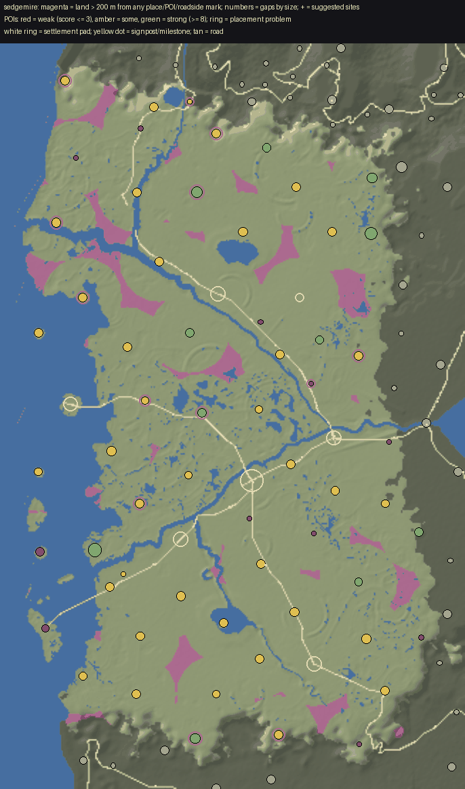

# World life audit: Sedgemire

Made by `python3 tools/world/region_audit.py sedgemire` from the installed world (2026-10-03T17:07:31Z) and the content pack; the POI measurements are `docs/review/world_life/probe_sedgemire.json` (tools_gd/poi_probe.gd, headless). docs/WORLD_LIFE.md says how to read and use it.

## Summary

| | |
|---|---|
| land a body walks (dry, no steeper than 32 deg, 250 m in from the map's edge) | 6.0 km2 |
| points of interest | 60 (10.0 per km2; 0 not yet in the built world) |
| land more than 200 m from any place, POI or roadside mark | 0.32 km2 (5%); more than 400 m: 0% |
| share of land further than 100 / 150 / 200 / 300 / 400 m from anything | 56% / 25% / 5% / 0% / 0% |
| largest empty stretch | 0.00 km2 |
| weak POIs (score <= 3) | 2, and 9 wayside finds (small by design) |
| strong POIs (score >= 8) | 11 |
| placement problems | 14, at 13 POIs |

## (a) Empty land, largest first

A stretch is land of the region more than 200 m from the edge of every place's, POI's and roadside mark's pad. `furthest` is how far its middle is from anything. Sites are gentle ground (<= 14 deg) in it, as far from everything as it allows, nearer a road where one is near.

| # | middle (x, z) | km2 | extent m | furthest m | slope mean/p75 | height | province (biome) | road | sites (x, z, slope, road m) |
|---|---|---|---|---|---|---|---|---|---|

## (b) Points of interest, weakest first

Impact score, points for each: **size** footprint reach (m from the middle to its furthest piece): <8 = 0, <14 = 1, <22 = 2, <32 = 3, else 4; **things** interactables in the dressing (Hearthstone, touch, container, readable ...): 1 each, up to 3; **foes** an encounter that stands foes up: 1, and 1 more for 4 or more; **loot** something to take (an encounter's `lies`, a quest's item, a find): 1; **people** an NPC who lives or stands there: 1, 2 for two or more; **quest** a quest sends you there: 2; **interior** a door into an interior: 2; **landmark** a landmark model (a `scene` in pois.json): 2; **hearth** a Hearthstone: 1. **Weak** is 3 or under; **small** is a reach under 10 m. `reach` is metres from the middle to the furthest piece; `things` are interactables in the dressing (hearthstones, touches, containers); foes are the encounter's standing count; loot counts an encounter's `lies`, a find and a container.

| score | POI | kind | reach / pad m | pieces | draws | tris k | things | foes | loot | NPCs | quest | enc | interior | hearth | landmark | flags |
|---|---|---|---|---|---|---|---|---|---|---|---|---|---|---|---|---|
| 1 | The Drowned Road Post `drowned_road_post` | lantern_post | 1 / 14 | 9 | 9 | 11 | 0 | 0 | 2 | 0 |  | yes |  |  |  | WEAK small wayside |
| 1 | The Eel-Smoker's Hut `eel_smokers_hut` | hut | 6 / 14 | 15 | 15 | 35 | 0 | 0 | 2 | 0 |  | yes |  |  |  | WEAK small wayside |
| 1 | The Peat-Cutters' Light `peat_cutters_light` | lantern_post | 6 / 14 | 17 | 17 | 13 | 0 | 0 | 2 | 0 |  | yes |  |  |  | WEAK small wayside |
| 1 | The Pushers' Stones `pushers_stones` | standing_stones | 7 / 14 | 12 | 12 | 52 | 0 | 0 | 2 | 0 |  | yes |  |  |  | WEAK small wayside |
| 2 | The Settled House `settled_house` | ruins | 7 / 14 | 5 | 5 | 1 | 0 | 2 | 4 | 0 |  | yes |  |  |  | WEAK small wayside |
| 2 | The Drowned Byre `drowned_byre` | ruins | 7 / 14 | 4 | 4 | 4 | 0 | 2 | 2 | 0 |  | yes |  |  |  | WEAK small wayside |
| 3 | The Tideflat Stones `tideflat_stones` | standing_stones | 10 / 25 | 9 | 9 | 9 | 1 | 0 | 2 | 0 |  | yes |  |  |  | WEAK |
| 3 | The Broken Stilts `broken_stilts` | ruins | 11 / 14 | 4 | 4 | 11 | 0 | 1 | 2 | 0 |  | yes |  |  |  | WEAK wayside |
| 3 | The Lantern-Wright's Camp `lantern_wrights_camp` | camp | 13 / 14 | 56 | 56 | 54 | 0 | 2 | 2 | 0 |  | yes |  |  |  | WEAK wayside |
| 3 | The Traders' Post `traders_post` | camp | 13 / 22 | 12 | 12 | 17 | 0 | 0 | 0 | 0 | yes |  |  |  |  | WEAK |
| 3 | The Lantern Hummock `lantern_hummock` | shrine | 15 / 14 | 36 | 36 | 15 | 0 | 0 | 2 | 0 |  | yes |  |  |  | WEAK wayside |
| 4 | The Knuckle Cairn `knuckle_cairn` | standing_stones | 6 / 25 | 8 | 8 | 62 | 1 | 4 | 2 | 0 |  | yes |  |  |  | small |
| 4 | The Eel-Boat Graveyard `eelboat_graveyard` | wreck | 9 / 25 | 31 | 31 | 64 | 0 | 3 | 0 | 0 | yes | yes |  |  |  | small |
| 4 | The Drowned Trader `drowned_trader` | wreck | 10 / 14 | 11 | 11 | 5 | 1 | 2 | 2 | 0 |  | yes |  |  |  | small wayside |
| 4 | The Drowned Arch `drowned_arch` | bridge | 12 / 25 | 10 | 10 | 30 | 1 | 2 | 2 | 0 |  | yes |  |  |  |  |
| 4 | The Draining Mill `draining_mill` | mill | 13 / 26 | 31 | 31 | 42 | 0 | 4 | 2 | 0 |  | yes |  |  |  |  |
| 4 | The Grey Gull `grey_gull` | wreck | 14 / 25 | 19 | 19 | 22 | 1 | 2 | 2 | 0 |  | yes |  |  |  |  |
| 4 | The Bog-Iron Bloomery `bog_iron_bloomery` | camp | 14 / 24 | 74 | 74 | 77 | 0 | 2 | 2 | 0 |  | yes |  |  |  |  |
| 4 | The Grey Line `grey_line` | strange | 15 / 24 | 9 | 9 | 44 | 0 | 3 | 2 | 0 |  | yes |  |  |  |  |
| 4 | The Lead-Carriers' Rest `lead_carriers_rest` | camp | 16 / 14 | 62 | 62 | 55 | 0 | 2 | 2 | 0 |  | yes |  |  |  | wayside |
| 4 | The Stair of Isse `stair_of_isse` | ruins | 17 / 25 | 9 | 9 | 61 | 0 | 3 | 2 | 0 |  | yes |  |  |  |  |
| 4 | Isse's Chair `isses_chair` | shrine | 17 / 24 | 14 | 14 | 15 | 0 | 0 | 2 | 1 |  | yes |  |  |  |  |
| 4 | The Reed Bridge `reed_bridge` | bridge | 19 / 25 | 7 | 7 | 5 | 0 | 2 | 2 | 0 |  | yes |  |  |  |  |
| 4 | The Indigo Beds `indigo_beds` | camp | 20 / 22 | 29 | 29 | 11 | 1 | 0 | 2 | 0 |  | yes |  |  |  |  |
| 4 | The Sallow King `sallow_king` | strange_tree | 22 / 25 | 51 | 75 | 92 | 0 | 2 | 2 | 0 |  | yes |  |  |  |  |
| 5 | Heron Watch `heron_watch` | tower | 12 / 25 | 22 | 22 | 22 | 0 | 0 | 2 | 1 | yes | yes |  |  |  |  |
| 5 | The Fog Bell `fog_bell` | tower | 12 / 25 | 21 | 21 | 46 | 1 | 2 | 0 | 0 | yes | yes |  |  |  |  |
| 5 | The Reed Wreck `reed_wreck` | wreck | 13 / 25 | 9 | 9 | 16 | 1 | 4 | 2 | 0 |  | yes |  |  |  |  |
| 5 | Crookstilts `crookstilts` | tower | 13 / 25 | 34 | 34 | 52 | 1 | 4 | 2 | 0 |  | yes |  |  |  |  |
| 5 | The Sunken Tower `sunken_tower` | tower | 16 / 25 | 9 | 9 | 27 | 1 | 2 | 2 | 0 |  | yes |  |  |  |  |
| 5 | The Salt Pans `salt_pans` | camp | 17 / 22 | 23 | 23 | 8 | 1 | 0 | 0 | 0 | yes |  |  |  |  |  |
| 5 | Oskel Ford `oskel_ford` | bridge | 19 / 25 | 13 | 13 | 13 | 1 | 3 | 2 | 0 |  | yes |  |  |  |  |
| 5 | The Boardwalk Gate `boardwalk_gate` | bridge | 21 / 25 | 9 | 9 | 9 | 1 | 0 | 0 | 0 | yes |  |  |  |  |  |
| 5 | The Greyreed Decoy `greyreed_decoy` | camp | 24 / 22 | 17 | 17 | 88 | 0 | 0 | 0 | 0 | yes |  |  |  |  |  |
| 5 | The Lantern Causeway `lantern_causeway` | bridge | 25 / 25 | 15 | 15 | 20 | 0 | 2 | 0 | 1 |  | yes |  |  |  |  |
| 6 | The Withy Beds `withy_beds` | camp | 16 / 22 | 7 | 7 | 41 | 0 | 2 | 2 | 0 | yes | yes |  |  |  |  |
| 6 | The Drylanders' Hummock `drylanders_hummock` | grave | 18 / 22 | 25 | 25 | 7 | 0 | 2 | 2 | 0 | yes | yes |  |  |  |  |
| 6 | Saoul `saoul` | ruins | 18 / 25 | 8 | 8 | 16 | 1 | 3 | 0 | 0 | yes | yes |  |  |  |  |
| 6 | The Cockle Beds `cockle_beds` | camp | 20 / 22 | 14 | 14 | 70 | 1 | 2 | 0 | 0 | yes | yes |  |  |  |  |
| 6 | Hester's House `hesters_stilts` | farmstead | 21 / 28 | 39 | 39 | 37 | 0 | 0 | 2 | 1 | yes | yes |  |  |  |  |
| 6 | The Round Stones `round_stones` | standing_stones | 23 / 25 | 18 | 18 | 20 | 1 | 3 | 2 | 0 |  | yes |  |  |  |  |
| 6 | The Eel Hurdles `eel_hurdles` | camp | 26 / 22 | 12 | 12 | 67 | 0 | 0 | 2 | 0 | yes | yes |  |  |  |  |
| 6 | The Drowned Road `drowned_road` | ruins | 29 / 25 | 7 | 8 | 27 | 1 | 2 | 2 | 0 |  | yes |  |  |  |  |
| 7 | The Tide Hearth `tide_hearth` | shrine | 14 / 25 | 40 | 40 | 18 | 1 | 0 | 0 | 1 | yes |  |  | yes |  |  |
| 7 | The South Stilts `south_stilts` | tower | 19 / 25 | 29 | 29 | 30 | 1 | 0 | 2 | 1 | yes | yes |  |  |  |  |
| 7 | The Old Crannog `old_crannog` | ruins | 19 / 25 | 11 | 12 | 48 | 1 | 2 | 0 | 1 | yes | yes |  |  |  |  |
| 7 | The Eel Stews `eel_stews` | ruins | 22 / 25 | 12 | 12 | 40 | 1 | 2 | 2 | 0 | yes | yes |  |  |  |  |
| 7 | The Long Jetty `long_jetty` | bridge | 24 / 25 | 7 | 7 | 12 | 1 | 2 | 0 | 0 | yes | yes |  |  |  |  |
| 7 | Mor'oul `mor_oul` | ruins | 26 / 25 | 9 | 9 | 22 | 1 | 3 | 0 | 0 | yes | yes |  |  |  |  |
| 8 | Drowned Bell Shrine `drowned_bell_shrine` | shrine | 15 / 25 | 43 | 43 | 17 | 1 | 2 | 4 | 0 | yes | yes |  | yes |  |  |
| 8 | The Eel Tally `eel_tally` | tally_post | 18 / 22 | 37 | 37 | 59 | 1 | 1 | 2 | 1 | yes | yes |  |  |  |  |
| 8 | The Leech-Wife's Stilts `leech_wifes_stilts` | hut | 19 / 24 | 41 | 41 | 37 | 0 | 4 | 2 | 1 | yes | yes |  |  |  |  |
| 8 | Greylag Fold `greylag_fold` | fold | 20 / 24 | 53 | 53 | 67 | 0 | 3 | 2 | 2 | yes | yes |  |  |  |  |
| 8 | Wisp Hollow `wisp_hollow` | hidden_valley | 22 / 25 | 17 | 17 | 7 | 0 | 4 | 2 | 0 | yes | yes |  |  |  |  |
| 9 | The Peat Hags `peat_hags` | camp | 19 / 22 | 17 | 17 | 10 | 0 | 4 | 2 | 2 | yes | yes |  |  |  |  |
| 9 | The Stakes at Oulnauve `oulnauve_stakes` | stockade | 22 / 28 | 187 | 187 | 111 | 1 | 4 | 2 | 0 | yes | yes |  |  |  |  |
| 11 | The Name-Wife's Hollow `name_wifes_hollow` | delve | 30 / 28 | 87 | 87 | 163 | 2 | 5 | 0 | 0 | yes | yes | yes |  |  |  |
| 11 | The Saltgate `the_saltgate` | fort | 37 / 37 | 109 | 109 | 90 | 2 | 3 | 0 | 0 | yes | yes | yes |  |  |  |
| 12 | The Sounding `the_sounding` | tower | 22 / 34 | 58 | 58 | 61 | 2 | 8 | 2 | 0 | yes | yes | yes |  |  |  |
| 12 | The Unsung Vault `unsung_vault` | delve | 33 / 30 | 82 | 82 | 87 | 2 | 2 | 2 | 0 | yes | yes | yes |  |  |  |

Weak POIs by kind (not wayside): standing_stones 1, camp 1.

## (c) Placement problems

`seat:*` are the seat audit's findings over the POI's own pieces (tools_gd/seat_audit.gd: floating over the ground, buried, sunk, standing in a road's carriageway, overlapping another piece, a lamp or light hung from nothing; headless, so multimesh rows are not looked at). `past_pad`: pieces stand beyond the flattened pad, on the skirt or raw ground. `steep_skirt`: the pad's skirt (from its level core to its reach) falls at more than 33 deg along some line: a cut or an embankment. `steep_site`: a POI not yet built stands on ground sloping more than 18 deg on average under its pad. `overlap_pad`: two pads overlap. `road_through`: a road crosses the level core of a place that is not road furniture. `in_water`: its middle is in water.

Counts: past_pad 4, steep_skirt 3, seat:sunk 2, seat:overlap 2, seat:floating 2, seat:buried 1.

| POI | problem | n | detail |
|---|---|---|---|
| `drowned_road` | past_pad | 1 | pieces reach 29 m from its middle; its pad is 25 m |
| `eel_hurdles` | past_pad | 1 | pieces reach 26 m from its middle; its pad is 22 m |
| `name_wifes_hollow` | past_pad | 1 | pieces reach 30 m from its middle; its pad is 28 m |
| `unsung_vault` | past_pad | 1 | pieces reach 33 m from its middle; its pad is 30 m |
| `eel_stews` | seat:buried | 1 | drymud DryMud at (-1993, -650): all of it under the ground (top 0.04 m below the lowest ground under it) |
| `old_crannog` | seat:floating | 2 | door Door at (-2800, -1897): 1.30 m over the ground |
| `sunken_tower` | seat:floating | 1 | rowboat sedgemire_rowboat_a.glb at (-3544, -973): 0.18 m over the ground |
| `lead_carriers_rest` | seat:overlap | 1 | crate briarwold_crate_b.glb at (-2947, -2078): 66% of it shares its box with crate (poi:camp) |
| `sallow_king` | seat:overlap | 18 | willow sedgemire_willow_a.glb at (-3230, 180): 75% of it shares its box with willow (poi:strange_tree) |
| `drowned_bell_shrine` | seat:sunk | 1 | bell_medium cinderlea_bell_medium_a.glb at (-2878, -339): 86% of its 3.7 m under the ground at its middle |
| `lantern_hummock` | seat:sunk | 1 | bell_medium cinderlea_bell_medium_a.glb at (-2258, -497): 86% of its 3.7 m under the ground at its middle |
| `grey_gull` | steep_skirt | 1 | its pad's skirt falls at 63 deg: a cut or an embankment |
| `old_crannog` | steep_skirt | 1 | its pad's skirt falls at 40 deg: a cut or an embankment |
| `south_stilts` | steep_skirt | 1 | its pad's skirt falls at 49 deg: a cut or an embankment |
