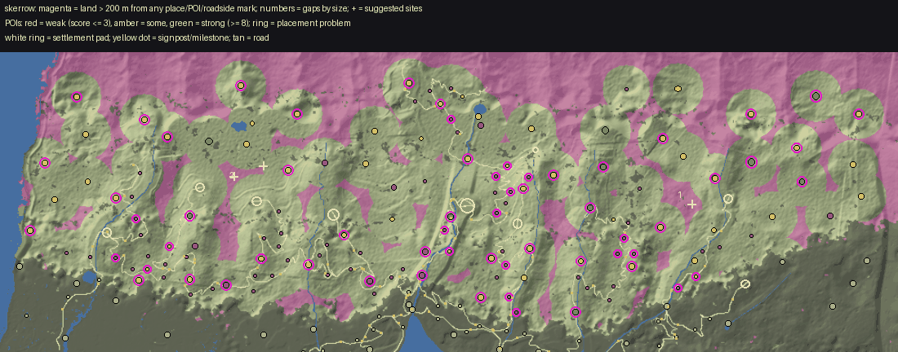

# World life audit: Skerrow

Made by `python3 tools/world/region_audit.py skerrow` from the installed world (2026-09-28T18:00:36Z) and the content pack; the POI measurements are `docs/review/world_life/probe_skerrow.json` (tools_gd/poi_probe.gd, headless). docs/WORLD_LIFE.md says how to read and use it.

## Summary

| | |
|---|---|
| land a body walks (dry, no steeper than 32 deg, 250 m in from the map's edge) | 8.7 km2 |
| points of interest | 137 (15.7 per km2; 18 not yet in the built world) |
| land more than 200 m from any place, POI or roadside mark | 1.13 km2 (13%); more than 400 m: 0% |
| share of land further than 100 / 150 / 200 / 300 / 400 m from anything | 55% / 31% / 13% / 2% / 0% |
| largest empty stretch | 0.05 km2 |
| weak POIs (score <= 3) | 9, and 62 wayside finds (small by design) |
| strong POIs (score >= 8) | 10 |
| placement problems | 98, at 62 POIs |

## (a) Empty land, largest first

A stretch is land of the region more than 200 m from the edge of every place's, POI's and roadside mark's pad. `furthest` is how far its middle is from anything. Sites are gentle ground (<= 14 deg) in it, as far from everything as it allows, nearer a road where one is near.

| # | middle (x, z) | km2 | extent m | furthest m | slope mean/p75 | height | province (biome) | road | sites (x, z, slope, road m) |
|---|---|---|---|---|---|---|---|---|---|
| 1 | (2180, -2836) | 0.05 | 376 x 432 | 311 | 20 / 26 | 373 | The Skarl Fells (mountains) | nearest 176 m | (2276, -2756) 4 deg 276 m |
| 2 | (-1772, -3012) | 0.04 | 408 x 320 | 269 | 10 / 14 | 415 | The Upper Dales (mountains) | nearest 200 m | (-1764, -2996) 1 deg 271 m; (-1500, -3092) 7 deg 304 m |

## (b) Points of interest, weakest first

Impact score, points for each: **size** footprint reach (m from the middle to its furthest piece): <8 = 0, <14 = 1, <22 = 2, <32 = 3, else 4; **things** interactables in the dressing (Hearthstone, touch, container, readable ...): 1 each, up to 3; **foes** an encounter that stands foes up: 1, and 1 more for 4 or more; **loot** something to take (an encounter's `lies`, a quest's item, a find): 1; **people** an NPC who lives or stands there: 1, 2 for two or more; **quest** a quest sends you there: 2; **interior** a door into an interior: 2; **landmark** a landmark model (a `scene` in pois.json): 2; **hearth** a Hearthstone: 1. **Weak** is 3 or under; **small** is a reach under 10 m. `reach` is metres from the middle to the furthest piece; `things` are interactables in the dressing (hearthstones, touches, containers); foes are the encounter's standing count; loot counts an encounter's `lies`, a find and a container.

| score | POI | kind | reach / pad m | pieces | draws | tris k | things | foes | loot | NPCs | quest | enc | interior | hearth | landmark | flags |
|---|---|---|---|---|---|---|---|---|---|---|---|---|---|---|---|---|
| 1 | Dreugh's Lookout `dreughs_lookout` | vista | 0 / 14 | 3 | 3 | 71 | 0 | 0 | 4 | 0 |  | yes |  |  |  | WEAK small wayside |
| 1 | The Last Cairn `last_cairn` | vista | 0 / 14 | 3 | 3 | 91 | 0 | 0 | 2 | 0 |  | yes |  |  |  | WEAK small wayside |
| 1 | The Small-Debts Post `small_debts_post` | tally_post | 1 / 14 | 16 | 16 | 95 | 0 | 0 | 2 | 0 |  | yes |  |  |  | WEAK small wayside |
| 1 | The News-Owed Post `news_owed_post` | tally_post | 1 / 14 | 16 | 16 | 95 | 0 | 0 | 2 | 0 |  | yes |  |  |  | WEAK small wayside |
| 1 | The Unsaid Post `unsaid_post` | tally_post | 1 / 14 | 16 | 16 | 83 | 0 | 0 | 2 | 0 |  | yes |  |  |  | WEAK small wayside |
| 1 | The Charter-Debt Post `charter_debt_post` | tally_post | 1 / 14 | 16 | 16 | 90 | 0 | 0 | 2 | 0 |  | yes |  |  |  | WEAK small wayside |
| 1 | The Scar Cairn `scar_cairn` | cairn | 2 / 14 | 7 | 7 | 104 | 0 | 0 | 2 | 0 |  | yes |  |  |  | WEAK small wayside |
| 1 | The Ice-Block Cairn `ice_block_cairn` | cairn | 2 / 14 | 7 | 7 | 104 | 0 | 0 | 2 | 0 |  | yes |  |  |  | WEAK small wayside |
| 1 | The Hold's Last Look `last_look_cairn` | cairn | 2 / 14 | 7 | 7 | 104 | 0 | 0 | 2 | 0 |  | yes |  |  |  | WEAK small wayside |
| 1 | The Forgiveness Cairn `forgiveness_cairn` | cairn | 2 / 14 | 7 | 7 | 134 | 0 | 0 | 2 | 0 |  | yes |  |  |  | WEAK small wayside |
| 1 | The Peat-Road Cairn `peat_road_cairn` | cairn | 2 / 14 | 7 | 7 | 111 | 0 | 0 | 2 | 0 |  | yes |  |  |  | WEAK small wayside |
| 1 | The Kept-Oaths Cairn `kept_oaths_cairn` | cairn | 2 / 14 | 7 | 7 | 134 | 0 | 0 | 2 | 0 |  | yes |  |  |  | WEAK small wayside |
| 1 | The Bier Stone `bier_stone` | waystone | 2 / 14 | 7 | 7 | 1 | 0 | 0 | 2 | 0 |  | yes |  |  |  | WEAK small wayside |
| 1 | The Patter Stone `patter_stone` | waystone | 2 / 14 | 7 | 7 | 1 | 0 | 0 | 2 | 0 |  | yes |  |  |  | WEAK small wayside |
| 1 | The Cathedral Spring `cathedral_spring` | well | 2 / 14 | 8 | 8 | 1 | 0 | 0 | 2 | 0 |  | yes |  |  |  | WEAK small wayside |
| 1 | The Skarl Drove-Well `skarl_drove_well` | well | 2 / 14 | 8 | 8 | 1 | 0 | 0 | 2 | 0 |  | yes |  |  |  | WEAK small wayside unbuilt |
| 1 | The First Verse `first_verse` | waystone | 2 / 14 | 7 | 7 | 1 | 0 | 0 | 2 | 0 |  | yes |  |  |  | WEAK small wayside |
| 1 | The Oathbreaker's Stone `oathbreakers_stone` | waystone | 2 / 14 | 10 | 10 | 2 | 0 | 0 | 2 | 0 |  | yes |  |  |  | WEAK small wayside |
| 1 | The Neither Stone `neither_stone` | waystone | 2 / 14 | 7 | 7 | 1 | 0 | 0 | 2 | 0 |  | yes |  |  |  | WEAK small wayside |
| 1 | Old Kharrow's Rest `old_kharrows_rest` | waystone | 2 / 14 | 7 | 7 | 1 | 0 | 0 | 2 | 0 |  | yes |  |  |  | WEAK small wayside unbuilt |
| 1 | The Unroping Post `unroping_post` | gibbet | 3 / 14 | 4 | 4 | 9 | 0 | 0 | 2 | 0 |  | yes |  |  |  | WEAK small wayside unbuilt |
| 1 | The Smelters' Stone `smelters_stone` | shrine | 3 / 14 | 24 | 24 | 17 | 0 | 0 | 2 | 0 |  | yes |  |  |  | WEAK small wayside |
| 1 | The Falls-Road Finger `falls_road_finger` | shrine | 4 / 14 | 26 | 26 | 41 | 0 | 0 | 2 | 0 |  | yes |  |  |  | WEAK small wayside |
| 1 | The Shaft Pebbles `shaft_pebbles` | shrine | 4 / 14 | 23 | 23 | 468 | 0 | 0 | 2 | 0 |  | yes |  |  |  | WEAK small wayside |
| 1 | The Rudd Anchorite `rudd_anchorite` | hut | 6 / 14 | 10 | 10 | 6 | 0 | 0 | 2 | 0 |  | yes |  |  |  | WEAK small wayside |
| 1 | Kharrow Gate `kharrow_gate` | tower | 6 / 25 | 12 | 12 | 54 | 0 | 0 | 2 | 0 |  | yes |  |  |  | WEAK small |
| 1 | The Two-Knot Fold `two_knot_fold` | fold | 7 / 14 | 17 | 17 | 36 | 0 | 0 | 2 | 0 |  | yes |  |  |  | WEAK small wayside |
| 1 | The Clanless Fold `clanless_fold` | fold | 7 / 14 | 15 | 15 | 15 | 0 | 0 | 2 | 0 |  | yes |  |  |  | WEAK small wayside |
| 1 | The Drove Chain `drove_chain` | standing_stones | 7 / 25 | 12 | 12 | 50 | 0 | 0 | 2 | 0 |  | yes |  |  |  | WEAK small |
| 1 | The Debtors' Lean `debtors_lean` | standing_stones | 7 / 14 | 12 | 12 | 55 | 0 | 0 | 2 | 0 |  | yes |  |  |  | WEAK small wayside |
| 1 | The Neither Fold `neither_fold` | fold | 7 / 14 | 15 | 15 | 21 | 0 | 0 | 2 | 0 |  | yes |  |  |  | WEAK small wayside |
| 1 | The Oskelcrag Peat Bank `oskelcrag_peat_bank` | peat_cut | 7 / 14 | 12 | 12 | 15 | 0 | 0 | 2 | 0 |  | yes |  |  |  | WEAK small wayside |
| 1 | The Counting Fold `counting_fold` | fold | 7 / 14 | 15 | 15 | 18 | 0 | 0 | 2 | 0 |  | yes |  |  |  | WEAK small wayside |
| 1 | The Winter-Herd Fold `winter_herd_fold` | fold | 7 / 14 | 15 | 15 | 15 | 0 | 0 | 2 | 0 |  | yes |  |  |  | WEAK small wayside |
| 2 | The Two-Clan Cairn `two_clan_cairn` | vista | 0 / 14 | 3 | 3 | 71 | 0 | 2 | 2 | 0 |  | yes |  |  |  | WEAK small wayside |
| 2 | The Slag Cairn `slag_cairn` | vista | 0 / 14 | 3 | 3 | 91 | 0 | 1 | 2 | 0 |  | yes |  |  |  | WEAK small wayside |
| 2 | The Raiders' Perch `raiders_perch` | vista | 0 / 14 | 3 | 3 | 91 | 0 | 2 | 2 | 0 |  | yes |  |  |  | WEAK small wayside |
| 2 | The Shift Stone `shift_stone` | waystone | 2 / 14 | 7 | 7 | 1 | 0 | 1 | 2 | 0 |  | yes |  |  |  | WEAK small wayside |
| 2 | The Newsmonger's Stone `newsmongers_stone` | waystone | 2 / 14 | 7 | 7 | 1 | 0 | 3 | 2 | 0 |  | yes |  |  |  | WEAK small wayside |
| 2 | The Skerr Stone `skerr_stone` | waystone | 2 / 25 | 10 | 10 | 2 | 0 | 0 | 0 | 0 | yes |  |  |  |  | WEAK small |
| 2 | The Singing Seat `singing_seat` | shrine | 3 / 14 | 24 | 24 | 17 | 0 | 1 | 2 | 0 |  | yes |  |  |  | WEAK small wayside |
| 2 | The Pitch-Pot Shrine `pitch_pot_shrine` | shrine | 3 / 14 | 24 | 24 | 18 | 0 | 1 | 2 | 0 |  | yes |  |  |  | WEAK small wayside |
| 2 | Brindle's Luck `brindles_luck` | shrine | 3 / 14 | 37 | 37 | 31 | 0 | 2 | 2 | 0 |  | yes |  |  |  | WEAK small wayside |
| 2 | The Knotted Rope `knotted_rope` | shrine | 3 / 14 | 24 | 24 | 17 | 0 | 2 | 2 | 0 |  | yes |  |  |  | WEAK small wayside |
| 2 | The Dreugh-Road Beacon `dreugh_road_beacon` | beacon | 3 / 14 | 11 | 11 | 6 | 0 | 2 | 2 | 0 |  | yes |  |  |  | WEAK small wayside |
| 2 | The Dale Watch `dale_watch` | tower | 6 / 25 | 12 | 12 | 50 | 0 | 0 | 0 | 0 | yes |  |  |  |  | WEAK small |
| 2 | Brindle Swallow `brindle_swallow` | standing_stones | 6 / 25 | 12 | 12 | 55 | 0 | 0 | 0 | 0 | yes |  |  |  |  | WEAK small |
| 2 | Kharrow's Cairns `kharrows_cairn` | standing_stones | 6 / 25 | 12 | 12 | 52 | 0 | 0 | 0 | 0 | yes |  |  |  |  | WEAK small |
| 2 | The Rope Cairn `rope_cairn` | standing_stones | 6 / 25 | 12 | 12 | 54 | 0 | 0 | 0 | 0 | yes |  |  |  |  | WEAK small |
| 2 | The Wolf Stones `wolf_stones` | standing_stones | 6 / 14 | 12 | 12 | 50 | 0 | 3 | 2 | 0 |  | yes |  |  |  | WEAK small wayside |
| 2 | The Blood-Price Stones `blood_price_stones` | standing_stones | 6 / 25 | 12 | 12 | 50 | 0 | 0 | 0 | 0 | yes |  |  |  |  | WEAK small |
| 2 | The Listening Stones `listening_stones` | standing_stones | 6 / 14 | 12 | 12 | 58 | 0 | 1 | 2 | 0 |  | yes |  |  |  | WEAK small wayside |
| 2 | The Clan Stones `clan_stones` | standing_stones | 9 / 25 | 28 | 28 | 126 | 0 | 0 | 2 | 0 |  | yes |  |  |  | WEAK small |
| 2 | The Oskel Smithy `oskel_smithy` | ruins | 10 / 14 | 12 | 12 | 130 | 0 | 0 | 2 | 0 |  | yes |  |  |  | WEAK wayside |
| 2 | The Rudd Mouth Bench `rudd_mouth_bench` | vista | 11 / 14 | 10 | 10 | 72 | 0 | 0 | 2 | 0 |  | yes |  |  |  | WEAK wayside |
| 2 | The Skarl Brow Bench `skarl_brow_bench` | vista | 11 / 14 | 10 | 10 | 92 | 0 | 0 | 2 | 0 |  | yes |  |  |  | WEAK wayside |
| 2 | The Brother's Seat `brothers_seat` | vista | 11 / 14 | 10 | 10 | 92 | 0 | 0 | 2 | 0 |  | yes |  |  |  | WEAK wayside |
| 2 | The Bone-Carvers' Camp `bone_carvers_camp` | camp | 13 / 14 | 74 | 74 | 69 | 0 | 0 | 2 | 0 |  | yes |  |  |  | WEAK wayside |
| 2 | The Cart-Wards' Post `cart_wards_post` | camp | 13 / 14 | 86 | 86 | 73 | 0 | 0 | 2 | 0 |  | yes |  |  |  | WEAK wayside |
| 3 | The Going-Up Cairn `going_up_cairn` | cairn | 2 / 14 | 7 | 7 | 134 | 0 | 0 | 2 | 0 | yes | yes |  |  |  | WEAK small wayside unbuilt |
| 3 | The Hag's Hut `hags_hut` | ruins | 10 / 14 | 21 | 21 | 146 | 0 | 1 | 2 | 0 |  | yes |  |  |  | WEAK wayside |
| 3 | The Unroofed Hold `unroofed_hold` | ruins | 10 / 14 | 21 | 21 | 144 | 0 | 1 | 2 | 0 |  | yes |  |  |  | WEAK wayside |
| 3 | The Burned Ore-House `burned_ore_house` | ruins | 10 / 14 | 21 | 21 | 146 | 0 | 2 | 2 | 0 |  | yes |  |  |  | WEAK wayside |
| 3 | The Old Toll-House `old_toll_house` | ruins | 10 / 14 | 21 | 21 | 137 | 0 | 1 | 4 | 0 |  | yes |  |  |  | WEAK wayside |
| 3 | The Swearers' Rest `swearers_rest` | vista | 11 / 14 | 10 | 10 | 92 | 0 | 2 | 2 | 0 |  | yes |  |  |  | WEAK wayside |
| 3 | Gann's Shieling `ganns_shieling` | shieling | 14 / 14 | 11 | 11 | 29 | 0 | 1 | 2 | 0 |  | yes |  |  |  | WEAK wayside |
| 3 | The Clanless Fire-Ring `clanless_fire_ring` | camp | 14 / 14 | 71 | 71 | 68 | 0 | 2 | 2 | 0 |  | yes |  |  |  | WEAK wayside |
| 3 | The Beacon Shieling `beacon_shieling` | shieling | 14 / 14 | 11 | 11 | 32 | 0 | 3 | 2 | 0 |  | yes |  |  |  | WEAK wayside |
| 3 | The Link-Keeper's Fire `link_keepers_fire` | camp | 14 / 14 | 77 | 77 | 76 | 0 | 0 | 2 | 0 |  | yes |  |  |  | WEAK wayside |
| 3 | The Namers' Fire `namers_fire` | camp | 15 / 14 | 68 | 68 | 68 | 0 | 0 | 2 | 0 |  | yes |  |  |  | WEAK wayside |
| 3 | The Oskel Drip `oskel_drip` | cave | 16 / 14 | 49 | 49 | 98 | 0 | 0 | 2 | 0 |  | yes |  |  |  | WEAK wayside |
| 4 | The Finger Shrine `sinkhole_shrine` | shrine | 4 / 25 | 33 | 33 | 42 | 1 | 0 | 0 | 0 | yes |  |  | yes |  | small |
| 4 | Rudd Pike Beacon `rudd_pike_beacon` | tower | 6 / 25 | 16 | 16 | 74 | 1 | 0 | 2 | 0 | yes | yes |  |  |  | small |
| 4 | The Skerry Watch `skerry_watch` | tower | 6 / 25 | 14 | 14 | 50 | 0 | 0 | 2 | 1 | yes | yes |  |  |  | small |
| 4 | The Breathing Stones `breathing_stones` | standing_stones | 6 / 25 | 14 | 14 | 50 | 1 | 0 | 2 | 0 | yes | yes |  |  |  | small |
| 4 | The Moot Beacon `moot_beacon` | tower | 6 / 25 | 15 | 15 | 68 | 0 | 0 | 2 | 1 | yes | yes |  |  |  | small |
| 4 | The Black Keep `black_keep` | tower | 6 / 25 | 12 | 12 | 45 | 1 | 0 | 2 | 0 | yes | yes |  |  |  | small |
| 4 | The Winter Cairns `winter_cairns` | standing_stones | 7 / 25 | 14 | 14 | 82 | 1 | 0 | 2 | 0 | yes | yes |  |  |  | small |
| 4 | Ghorrow `ghorrow` | ruins | 8 / 25 | 21 | 21 | 141 | 0 | 2 | 2 | 0 | yes | yes |  |  |  | small |
| 4 | The Leadhouse `the_leadhouse` | ruins | 8 / 25 | 21 | 21 | 137 | 0 | 3 | 4 | 0 | yes | yes |  |  |  | small unbuilt |
| 4 | The Briar's End `briars_end` | ruins | 8 / 25 | 5 | 7 | 103 | 0 | 0 | 2 | 0 | yes | yes |  |  |  | small |
| 4 | The Frost Moot `frost_moot` | ruins | 9 / 25 | 21 | 21 | 140 | 0 | 0 | 2 | 0 | yes | yes |  |  |  | small |
| 4 | The Oskel Rake `oskel_rake` | ruins | 9 / 25 | 21 | 21 | 137 | 0 | 2 | 0 | 0 | yes | yes |  |  |  | small |
| 4 | The Deadground `deadground` | ruins | 9 / 25 | 21 | 21 | 140 | 0 | 0 | 2 | 0 | yes | yes |  |  |  | small |
| 4 | The Seven Stones `lichen_stones` | standing_stones | 10 / 25 | 35 | 35 | 134 | 0 | 0 | 2 | 0 | yes | yes |  |  |  | small |
| 4 | Old Eld `old_eld` | ruins | 10 / 25 | 21 | 21 | 137 | 0 | 1 | 0 | 0 | yes | yes |  |  |  |  |
| 4 | The Whelping Hole `whelping_hole` | hidden_valley | 11 / 18 | 9 | 9 | 69 | 0 | 5 | 2 | 0 |  | yes |  |  |  | unbuilt |
| 4 | The Watch of the Gate `watch_of_the_gate` | tower | 13 / 25 | 26 | 26 | 30 | 1 | 0 | 2 | 1 |  | yes |  |  |  |  |
| 4 | Ruddale Bridge `ruddale_bridge` | bridge | 13 / 25 | 8 | 8 | 6 | 0 | 0 | 2 | 0 | yes | yes |  |  |  |  |
| 4 | The Oath-Takers' Fire `oath_takers_fire` | camp | 13 / 14 | 96 | 96 | 69 | 1 | 2 | 2 | 0 |  | yes |  |  |  | wayside |
| 4 | Skarl Shieling `skarl_shieling` | shieling | 14 / 25 | 14 | 14 | 39 | 0 | 0 | 0 | 1 | yes |  |  |  |  |  |
| 4 | Oskel Shieling `oskel_shieling` | shieling | 14 / 25 | 11 | 11 | 31 | 0 | 0 | 2 | 0 | yes | yes |  |  |  |  |
| 4 | The Tinkers' Camp `tinkers_camp` | camp | 14 / 22 | 73 | 73 | 80 | 0 | 0 | 2 | 1 |  | yes |  |  |  |  |
| 4 | The Gorge Porters `gorge_porters` | camp | 14 / 14 | 56 | 56 | 58 | 0 | 1 | 2 | 0 |  | yes |  |  |  | wayside |
| 4 | The Tappers' Camp `tappers_camp` | camp | 15 / 22 | 62 | 62 | 54 | 0 | 0 | 2 | 1 |  | yes |  |  |  |  |
| 4 | Rudd Mill `rudd_mill` | mill | 15 / 25 | 34 | 34 | 54 | 0 | 0 | 2 | 1 |  | yes |  |  |  |  |
| 4 | The Brakh's Eye `brakhs_eye` | giant_bones | 15 / 14 | 22 | 22 | 60 | 0 | 1 | 2 | 0 |  | yes |  |  |  | wayside |
| 4 | The Hidden Tarn `hidden_tarn` | hidden_valley | 16 / 25 | 12 | 12 | 193 | 0 | 3 | 2 | 0 |  | yes |  |  |  |  |
| 4 | Kharrow Hole `kharrow_hole` | cave | 16 / 25 | 49 | 49 | 96 | 0 | 3 | 2 | 0 |  | yes |  |  |  |  |
| 4 | The Horn Hole `horn_hole` | cave | 16 / 14 | 49 | 49 | 113 | 0 | 1 | 2 | 0 |  | yes |  |  |  | wayside |
| 4 | The Wrist Hole `wrist_hole` | cave | 17 / 14 | 49 | 49 | 110 | 0 | 2 | 2 | 0 |  | yes |  |  |  | wayside |
| 4 | Ghastfoot `ghastfoot` | ruins | 17 / 25 | 21 | 21 | 144 | 1 | 0 | 2 | 0 |  | yes |  |  |  |  |
| 4 | Kharrow Force `kharrow_force` | waterfall | 18 / 25 | 14 | 14 | 220 | 1 | 0 | 2 | 0 |  | yes |  |  |  |  |
| 4 | The Snow Shelter `snow_shelter` | camp | 18 / 22 | 56 | 56 | 55 | 1 | 0 | 2 | 0 |  | yes |  |  |  |  |
| 4 | The Rust Scar `rust_scar` | waterfall | 19 / 25 | 19 | 19 | 219 | 0 | 0 | 0 | 0 | yes |  |  |  |  |  |
| 4 | The Skarl Skull `skarl_skull` | giant_bones | 19 / 14 | 22 | 22 | 60 | 0 | 2 | 2 | 0 |  | yes |  |  |  | wayside |
| 4 | The Jawbone `the_jawbone` | giant_bones | 22 / 25 | 22 | 22 | 60 | 0 | 3 | 2 | 0 |  | yes |  |  |  |  |
| 5 | The Reckoner's Hut `reckoners_hut` | hut | 6 / 20 | 9 | 9 | 17 | 1 | 0 | 2 | 1 | yes | yes |  |  |  | small unbuilt |
| 5 | The Faceless Graves `faceless_graves` | grave | 6 / 25 | 7 | 7 | 0 | 1 | 2 | 2 | 0 | yes | yes |  |  |  | small unbuilt |
| 5 | The Drovers' Bothy `drovers_bothy` | camp | 13 / 22 | 62 | 62 | 57 | 0 | 0 | 2 | 1 | yes | yes |  |  |  |  |
| 5 | The Broom-Wife's Bield `broom_wifes_bield` | shieling | 13 / 25 | 13 | 13 | 37 | 0 | 0 | 2 | 1 | yes | yes |  |  |  | unbuilt |
| 5 | The Smeltings `the_smeltings` | camp | 15 / 22 | 83 | 83 | 69 | 1 | 0 | 0 | 0 | yes |  |  |  |  |  |
| 5 | The Ice-Cutters' Camp `ice_cutters_camp` | camp | 15 / 14 | 96 | 96 | 75 | 1 | 1 | 2 | 0 |  | yes |  |  |  | wayside |
| 5 | The Hanging Falls `hanging_falls` | waterfall | 18 / 25 | 19 | 19 | 234 | 0 | 0 | 2 | 0 | yes | yes |  |  |  |  |
| 5 | The Clanless Camp `clanless_camp` | camp | 18 / 22 | 86 | 86 | 84 | 0 | 3 | 0 | 0 | yes | yes |  |  |  |  |
| 5 | The Watcher `the_watcher` | giant_bones | 20 / 25 | 22 | 22 | 60 | 0 | 1 | 0 | 0 | yes | yes |  |  |  |  |
| 5 | Kharrow Foot `kharrow_foot` | market_field | 33 / 25 | 8 | 8 | 13 | 0 | 0 | 2 | 0 |  | yes |  |  |  |  |
| 5 | The Wading Giant `wading_giant` | giant_bones | 42 / 25 | 27 | 27 | 148 | 0 | 0 | 2 | 0 |  | yes |  |  |  |  |
| 6 | The Red Moor `red_moor` | standing_stones | 9 / 25 | 22 | 22 | 73 | 1 | 0 | 2 | 1 | yes | yes |  |  |  | small |
| 6 | Skarl Spout `skarl_spout` | waterfall | 18 / 25 | 25 | 25 | 232 | 0 | 2 | 0 | 1 | yes | yes |  |  |  |  |
| 6 | The Wall-Keepers' Ring `wall_keepers_ring` | walled_camp | 19 / 25 | 62 | 62 | 64 | 0 | 3 | 2 | 2 |  | yes |  |  |  | unbuilt |
| 6 | The Giants' Stair `giants_stair` | ruins | 20 / 25 | 9 | 9 | 61 | 0 | 1 | 2 | 0 | yes | yes |  |  |  |  |
| 6 | Uldra's Steading `uldras_steading` | farmstead | 20 / 25 | 40 | 40 | 41 | 0 | 2 | 2 | 2 |  | yes |  |  |  | unbuilt |
| 6 | The Three Sisters `three_sisters_falls` | waterfall | 25 / 25 | 35 | 35 | 202 | 1 | 2 | 0 | 0 |  | yes |  | yes |  |  |
| 7 | Pennant's Weather-House `pennants_weather_house` | hut | 11 / 20 | 33 | 33 | 152 | 1 | 2 | 2 | 1 | yes | yes |  |  |  | unbuilt |
| 7 | Skerrfall Quarry `skerrfall_quarry` | quarry | 21 / 25 | 24 | 24 | 37 | 0 | 1 | 2 | 1 | yes | yes |  |  |  | unbuilt |
| 7 | The Frozen Drove `frozen_drove` | strange | 21 / 28 | 9 | 9 | 26 | 1 | 3 | 2 | 0 | yes | yes |  |  |  | unbuilt |
| 8 | The Chain Bridge `chain_bridge` | bridge | 32 / 25 | 19 | 19 | 67 | 0 | 4 | 2 | 1 |  | yes |  |  |  |  |
| 8 | Ghast's Broken Bridge `ghasts_broken_bridge` | bridge | 33 / 25 | 19 | 19 | 69 | 0 | 3 | 2 | 0 | yes | yes |  |  |  |  |
| 8 | The Bonefield `the_bonefield` | giant_bones | 39 / 25 | 27 | 27 | 148 | 0 | 2 | 2 | 0 | yes | yes |  |  |  |  |
| 8 | The Bone Ford `bone_ford` | giant_bones | 41 / 25 | 27 | 27 | 157 | 0 | 0 | 2 | 1 | yes | yes |  |  |  |  |
| 8 | The Rib Cathedral `rib_cathedral` | giant_bones | 45 / 25 | 27 | 27 | 166 | 0 | 4 | 2 | 1 |  | yes |  |  |  |  |
| 8 | The Giant's Spine `giants_spine` | giant_bones | 46 / 25 | 27 | 27 | 157 | 0 | 2 | 2 | 0 | yes | yes |  |  |  |  |
| 9 | The Sorting Ground `sorting_ground` | giant_bones | 29 / 30 | 5 | 5 | 32 | 1 | 4 | 2 | 0 | yes | yes |  |  |  | unbuilt |
| 10 | Old Ghastow `old_ghastow` | castle_ruin | 30 / 32 | 61 | 61 | 47 | 2 | 0 | 2 | 0 | yes | yes | yes |  |  | unbuilt |
| 11 | The Brakh's Drink `brakhs_drink` | delve | 31 / 30 | 53 | 53 | 94 | 2 | 2 | 2 | 0 | yes | yes | yes |  |  | unbuilt |
| 11 | Orrdun `orrdun` | delve | 32 / 30 | 53 | 53 | 96 | 2 | 2 | 2 | 0 | yes | yes | yes |  |  | unbuilt |

Weak POIs by kind (not wayside): standing_stones 6, tower 2, waystone 1.

## (c) Placement problems

`seat:*` are the seat audit's findings over the POI's own pieces (tools_gd/seat_audit.gd: floating over the ground, buried, sunk, standing in a road's carriageway, overlapping another piece, a lamp or light hung from nothing; headless, so multimesh rows are not looked at). `past_pad`: pieces stand beyond the flattened pad, on the skirt or raw ground. `steep_skirt`: the pad's skirt (from its level core to its reach) falls at more than 33 deg along some line: a cut or an embankment. `steep_site`: a POI not yet built stands on ground sloping more than 18 deg on average under its pad. `overlap_pad`: two pads overlap. `road_through`: a road crosses the level core of a place that is not road furniture. `in_water`: its middle is in water.

Counts: steep_skirt 44, past_pad 11, seat:overlap 11, road_through 11, seat:on_road 6, seat:buried 5, seat:sunk 4, seat:fence_lone 3, seat:floating 3.

| POI | problem | n | detail |
|---|---|---|---|
| `bone_ford` | past_pad | 1 | pieces reach 41 m from its middle; its pad is 25 m |
| `chain_bridge` | past_pad | 1 | pieces reach 32 m from its middle; its pad is 25 m |
| `ghasts_broken_bridge` | past_pad | 1 | pieces reach 33 m from its middle; its pad is 25 m |
| `giants_spine` | past_pad | 1 | pieces reach 46 m from its middle; its pad is 25 m |
| `horn_hole` | past_pad | 1 | pieces reach 16 m from its middle; its pad is 14 m |
| `kharrow_foot` | past_pad | 1 | pieces reach 33 m from its middle; its pad is 25 m |
| `rib_cathedral` | past_pad | 1 | pieces reach 45 m from its middle; its pad is 25 m |
| `skarl_skull` | past_pad | 1 | pieces reach 19 m from its middle; its pad is 14 m |
| `the_bonefield` | past_pad | 1 | pieces reach 39 m from its middle; its pad is 25 m |
| `wading_giant` | past_pad | 1 | pieces reach 42 m from its middle; its pad is 25 m |
| `wrist_hole` | past_pad | 1 | pieces reach 17 m from its middle; its pad is 14 m |
| `bone_ford` | road_through | 1 | a road passes 1 m from its middle, inside its 18 m level core |
| `clanless_camp` | road_through | 1 | a road passes 0 m from its middle, inside its 15 m level core |
| `ghastfoot` | road_through | 1 | a road passes 0 m from its middle, inside its 18 m level core |
| `kharrow_force` | road_through | 1 | a road passes 14 m from its middle, inside its 18 m level core |
| `kharrow_gate` | road_through | 1 | a road passes 0 m from its middle, inside its 18 m level core |
| `rib_cathedral` | road_through | 1 | a road passes 0 m from its middle, inside its 18 m level core |
| `rudd_mill` | road_through | 1 | a road passes 10 m from its middle, inside its 18 m level core |
| `rust_scar` | road_through | 1 | a road passes 12 m from its middle, inside its 18 m level core |
| `snow_shelter` | road_through | 1 | a road passes 0 m from its middle, inside its 15 m level core |
| `three_sisters_falls` | road_through | 1 | a road passes 0 m from its middle, inside its 18 m level core |
| `watch_of_the_gate` | road_through | 1 | a road passes 2 m from its middle, inside its 18 m level core |
| `horn_hole` | seat:buried | 4 | throat2 Throat2 at (-2338, -2385): all of it under the ground (top 2.51 m below the lowest ground under it) |
| `kharrow_hole` | seat:buried | 4 | throat2 Throat2 at (514, -2284): all of it under the ground (top 1.56 m below the lowest ground under it) |
| `oskel_drip` | seat:buried | 4 | throat1 Throat1 at (-2801, -2276): all of it under the ground (top 1.42 m below the lowest ground under it) |
| `three_sisters_falls` | seat:buried | 1 | stair2 Stair2 at (-1116, -2237): all of it under the ground (top 1.16 m below the lowest ground under it) |
| `wrist_hole` | seat:buried | 4 | throat2 Throat2 at (650, -3100): all of it under the ground (top 2.56 m below the lowest ground under it) |
| `chain_bridge` | seat:fence_lone | 1 | drystone_wall skerrow_drystone_wall_a.glb at (145, -2638): a 2.6 m length of drystone_wall joined to no other |
| `ghasts_broken_bridge` | seat:fence_lone | 1 | drystone_wall skerrow_drystone_wall_a.glb at (-2154, -2646): a 2.4 m length of drystone_wall joined to no other |
| `watch_of_the_gate` | seat:fence_lone | 2 | drystone_wall skerrow_drystone_wall_a.glb at (-226, -3826): a 2.5 m length of drystone_wall joined to no other |
| `giants_stair` | seat:floating | 1 | rope_coil sedgemire_rope_coil_b.glb at (2795, -3537): 0.26 m over the ground |
| `rust_scar` | seat:floating | 1 | stream Stream at (781, -2896): 0.21 m over the ground |
| `winter_cairns` | seat:floating | 1 | pebble Pebble at (2002, -2556): 0.45 m over the ground |
| `bone_ford` | seat:on_road | 1 | standing_stone skerrow_standing_stone_b.glb at (1255, -1792): stands in the carriageway of merrowhithe_rib_cathedral |
| `clanless_camp` | seat:on_road | 1 | windbreak Windbreak at (-1519, -2265): stands in the carriageway of three_sisters_falls_clanless_camp |
| `kharrow_gate` | seat:on_road | 1 | drum Drum at (-100, -2120): stands in the carriageway of kharrow_gate_three_sisters_falls |
| `oskel_drip` | seat:on_road | 5 | throat1 Throat1 at (-2801, -2276): stands in the carriageway of clanless_camp_oskelcrag |
| `rib_cathedral` | seat:on_road | 1 | standing_stone skerrow_standing_stone_b.glb at (1376, -2713): stands in the carriageway of merrowhithe_rib_cathedral |
| `wolf_stones` | seat:on_road | 1 | standing_stone skerrow_standing_stone_a.glb at (158, -3500): stands in the carriageway of chain_bridge_windgate |
| `brakhs_drink` | seat:overlap | 9 | boulder skerrow_boulder_b.glb at (2806, -3130): 100% of it shares its box with boulder (poi:delve) |
| `brakhs_eye` | seat:overlap | 1 | campfire hearthvale_campfire_b.glb at (-2534, -2179): 100% of it shares its box with bone_skull_fragment (poi:giant_bones) |
| `clanless_camp` | seat:overlap | 1 | campfire hearthvale_campfire_b.glb at (-1522, -2273): 90% of it shares its box with stool (poi:camp) |
| `horn_hole` | seat:overlap | 5 | boulder skerrow_boulder_b.glb at (-2331, -2385): 100% of it shares its box with boulder (poi:cave) |
| `kharrow_hole` | seat:overlap | 5 | boulder skerrow_boulder_a.glb at (517, -2276): 64% of it shares its box with boulder (poi:cave) |
| `orrdun` | seat:overlap | 14 | boulder skerrow_boulder_b.glb at (3378, -3707): 99% of it shares its box with boulder (poi:delve) |
| `oskel_drip` | seat:overlap | 6 | boulder skerrow_boulder_b.glb at (-2804, -2270): 100% of it shares its box with boulder (poi:cave) |
| `skarl_skull` | seat:overlap | 2 | bone_skull_fragment skerrow_bone_skull_fragment_b.glb at (2317, -2109): 100% of it shares its box with campfire (poi:giant_bones) |
| `the_jawbone` | seat:overlap | 3 | bone_skull_fragment skerrow_bone_skull_fragment_a.glb at (-2350, -3350): 71% of it shares its box with bone_skull_fragment (poi:giant_bones) |
| `the_watcher` | seat:overlap | 2 | campfire hearthvale_campfire_a.glb at (3743, -3547): 100% of it shares its box with bone_skull_fragment (poi:giant_bones) |
| `wrist_hole` | seat:overlap | 4 | boulder skerrow_boulder_a.glb at (657, -3098): 88% of it shares its box with boulder (poi:cave) |
| `horn_hole` | seat:sunk | 4 | boulder skerrow_boulder_b.glb at (-2331, -2385): 68% of its 7.3 m under the ground at its middle |
| `kharrow_hole` | seat:sunk | 2 | boulder skerrow_boulder_c.glb at (518, -2279): 81% of its 5.4 m under the ground at its middle |
| `oskel_drip` | seat:sunk | 2 | boulder skerrow_boulder_a.glb at (-2802, -2270): 67% of its 5.8 m under the ground at its middle |
| `wrist_hole` | seat:sunk | 5 | boulder skerrow_boulder_a.glb at (656, -3100): 78% of its 4.6 m under the ground at its middle |
| `beacon_shieling` | steep_skirt | 1 | its pad's skirt falls at 33 deg: a cut or an embankment |
| `blood_price_stones` | steep_skirt | 1 | its pad's skirt falls at 75 deg: a cut or an embankment |
| `breathing_stones` | steep_skirt | 1 | its pad's skirt falls at 76 deg: a cut or an embankment |
| `cathedral_spring` | steep_skirt | 1 | its pad's skirt falls at 44 deg: a cut or an embankment |
| `chain_bridge` | steep_skirt | 1 | its pad's skirt falls at 36 deg: a cut or an embankment |
| `clanless_fire_ring` | steep_skirt | 1 | its pad's skirt falls at 43 deg: a cut or an embankment |
| `counting_fold` | steep_skirt | 1 | its pad's skirt falls at 41 deg: a cut or an embankment |
| `deadground` | steep_skirt | 1 | its pad's skirt falls at 52 deg: a cut or an embankment |
| `drove_chain` | steep_skirt | 1 | its pad's skirt falls at 41 deg: a cut or an embankment |
| `frost_moot` | steep_skirt | 1 | its pad's skirt falls at 52 deg: a cut or an embankment |
| `ghasts_broken_bridge` | steep_skirt | 1 | its pad's skirt falls at 62 deg: a cut or an embankment |
| `ghorrow` | steep_skirt | 1 | its pad's skirt falls at 62 deg: a cut or an embankment |
| `giants_spine` | steep_skirt | 1 | its pad's skirt falls at 58 deg: a cut or an embankment |
| `giants_stair` | steep_skirt | 1 | its pad's skirt falls at 80 deg: a cut or an embankment |
| `gorge_porters` | steep_skirt | 1 | its pad's skirt falls at 48 deg: a cut or an embankment |
| `hanging_falls` | steep_skirt | 1 | its pad's skirt falls at 42 deg: a cut or an embankment |
| `kharrow_force` | steep_skirt | 1 | its pad's skirt falls at 38 deg: a cut or an embankment |
| `kharrow_hole` | steep_skirt | 1 | its pad's skirt falls at 45 deg: a cut or an embankment |
| `last_look_cairn` | steep_skirt | 1 | its pad's skirt falls at 55 deg: a cut or an embankment |
| `link_keepers_fire` | steep_skirt | 1 | its pad's skirt falls at 43 deg: a cut or an embankment |
| `moot_beacon` | steep_skirt | 1 | its pad's skirt falls at 41 deg: a cut or an embankment |
| `neither_stone` | steep_skirt | 1 | its pad's skirt falls at 39 deg: a cut or an embankment |
| `old_eld` | steep_skirt | 1 | its pad's skirt falls at 54 deg: a cut or an embankment |
| `oskel_shieling` | steep_skirt | 1 | its pad's skirt falls at 58 deg: a cut or an embankment |
| `oskel_smithy` | steep_skirt | 1 | its pad's skirt falls at 58 deg: a cut or an embankment |
| `peat_road_cairn` | steep_skirt | 1 | its pad's skirt falls at 33 deg: a cut or an embankment |
| `raiders_perch` | steep_skirt | 1 | its pad's skirt falls at 43 deg: a cut or an embankment |
| `rudd_anchorite` | steep_skirt | 1 | its pad's skirt falls at 38 deg: a cut or an embankment |
| `rudd_mouth_bench` | steep_skirt | 1 | its pad's skirt falls at 51 deg: a cut or an embankment |
| `rust_scar` | steep_skirt | 1 | its pad's skirt falls at 37 deg: a cut or an embankment |
| `scar_cairn` | steep_skirt | 1 | its pad's skirt falls at 37 deg: a cut or an embankment |
| `sinkhole_shrine` | steep_skirt | 1 | its pad's skirt falls at 56 deg: a cut or an embankment |
| `skarl_shieling` | steep_skirt | 1 | its pad's skirt falls at 55 deg: a cut or an embankment |
| `skarl_spout` | steep_skirt | 1 | its pad's skirt falls at 74 deg: a cut or an embankment |
| `skerr_stone` | steep_skirt | 1 | its pad's skirt falls at 46 deg: a cut or an embankment |
| `skerry_watch` | steep_skirt | 1 | its pad's skirt falls at 58 deg: a cut or an embankment |
| `snow_shelter` | steep_skirt | 1 | its pad's skirt falls at 42 deg: a cut or an embankment |
| `tappers_camp` | steep_skirt | 1 | its pad's skirt falls at 33 deg: a cut or an embankment |
| `the_jawbone` | steep_skirt | 1 | its pad's skirt falls at 59 deg: a cut or an embankment |
| `the_smeltings` | steep_skirt | 1 | its pad's skirt falls at 64 deg: a cut or an embankment |
| `the_watcher` | steep_skirt | 1 | its pad's skirt falls at 33 deg: a cut or an embankment |
| `tinkers_camp` | steep_skirt | 1 | its pad's skirt falls at 59 deg: a cut or an embankment |
| `wading_giant` | steep_skirt | 1 | its pad's skirt falls at 78 deg: a cut or an embankment |
| `wrist_hole` | steep_skirt | 1 | its pad's skirt falls at 36 deg: a cut or an embankment |
